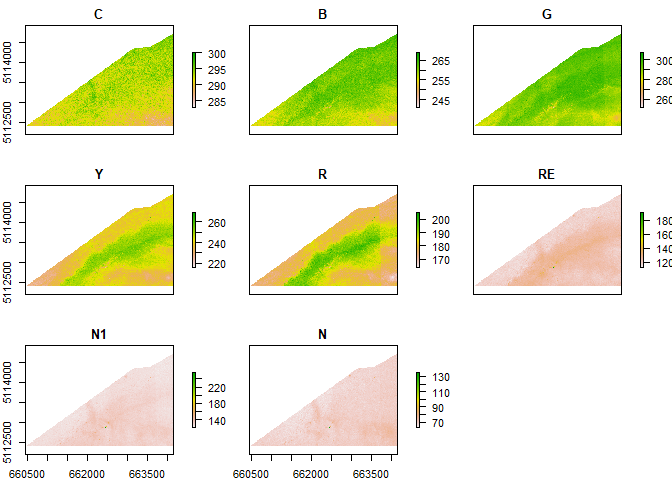
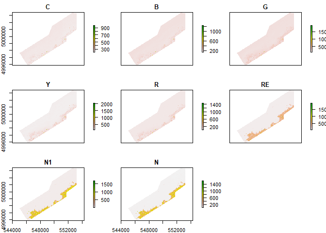
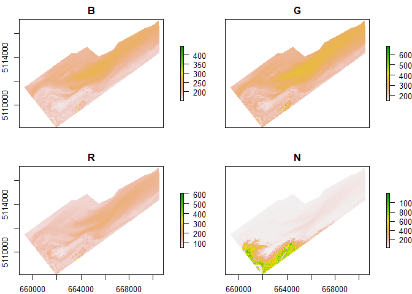
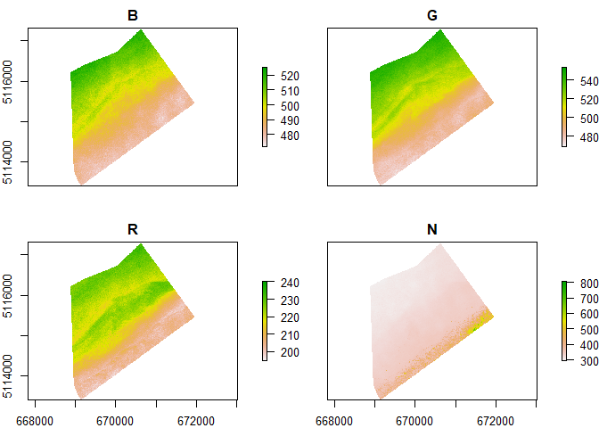
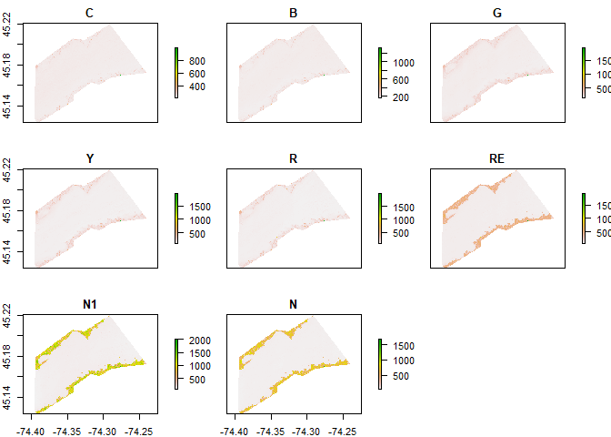
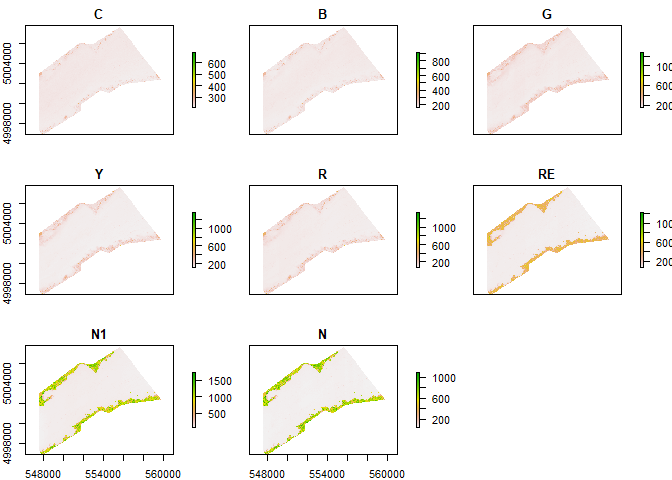

This first script is used to extract and validate metadata from high resolution images. It is adapted to the datastructure of DigitalGlobe products, including Quickbird and Worlview-02, 03 & 04

# R setup

All libraries must be installed prior to loading them. Installing them individually is the best course of action, using the install.packages("nameofthepackage") function


```r
# install.packages("raster") # exemple

rm(list=ls()) # clean R environment
library(sf) # for spatial simple feature objects
library(raster) # for spatial raster data
library(tidyverse) # for tidy data handling 
library(ggplot2) # for easy data plotting
library(leaflet) # for interactive maps
library(mapview) # for better interactive maps 
library(data.table) # for %like% function
library(kableExtra)
```


# What data do we have?

The first step is to catalogue everything that we got and determine how to read it efficiently. The directory has to be changed to a directory containing all the files to explore.


```r
imgs_dir = "X:/MFFP" # directory containg all satellite images (can be in different folders, to be found with recursive search)

#### extract date and type from the name ####
imgs = as.data.frame(dir(imgs_dir, recursive = T, pattern = ".TIF$")) # creates a dataframe of all image names 
imgs = imgs %>%
  mutate(date = lubridate::ymd_hms(str_match(imgs[,1], ".*(MUL|PAN)/(.*)(.-M|-P)2AS")[,3]))
imgs_MUL = imgs %>% 
  filter(str_detect(imgs[,1], "_MUL"))
imgs_PAN = imgs %>% 
  filter(str_detect(imgs[,1], "_PAN"))
```

## Multispectral images overview

Let's see what kind of data is contained in the multispectral (MUL) images.


```r
MUL_summary=tibble() # creates an empty tibble (dataframe)
for(i in 1:length(imgs_MUL[,1])){ # fills the tibble with information from the raster, including resolution and number of layers
  r = brick(paste0(imgs_dir,"/",imgs_MUL[,1][i])) # creates the raster bricks
  r_summary = cbind(print(res(r)[1]),print(nlayers(r)),print(crs(r)),print(imgs_MUL[i,]))
  MUL_summary = rbind(MUL_summary,r_summary)
}

colnames(MUL_summary) = c("res","nlayers","crs","path","date") # changes the variable names

MUL_summary = MUL_summary %>%  # adds information concerning the product ID from it's name.
  mutate(part = str_match(MUL_summary$path, ".*_01_(.*).TIF")[,2]) %>% 
  mutate(id = str_match(MUL_summary$path, ".*AS(_....-|-)(.*)_P")[,3]) %>% 
  mutate(id_part = paste0(id,"_",part))

MUL_summary = as.tibble(MUL_summary)
```

```
## Warning: `as.tibble()` is deprecated, use `as_tibble()` (but mind the new semantics).
## This warning is displayed once per session.
```


```r
kable(MUL_summary) %>% 
  kable_styling() %>% 
  scroll_box(width="600px",height="500px")
```

<div style="border: 1px solid #ddd; padding: 0px; overflow-y: scroll; height:500px; overflow-x: scroll; width:600px; "><table class="table" style="margin-left: auto; margin-right: auto;">
 <thead>
  <tr>
   <th style="text-align:right;position: sticky; top:0; background-color: #FFFFFF;"> res </th>
   <th style="text-align:right;position: sticky; top:0; background-color: #FFFFFF;"> nlayers </th>
   <th style="text-align:left;position: sticky; top:0; background-color: #FFFFFF;"> crs </th>
   <th style="text-align:left;position: sticky; top:0; background-color: #FFFFFF;"> path </th>
   <th style="text-align:left;position: sticky; top:0; background-color: #FFFFFF;"> date </th>
   <th style="text-align:left;position: sticky; top:0; background-color: #FFFFFF;"> part </th>
   <th style="text-align:left;position: sticky; top:0; background-color: #FFFFFF;"> id </th>
   <th style="text-align:left;position: sticky; top:0; background-color: #FFFFFF;"> id_part </th>
  </tr>
 </thead>
<tbody>
  <tr>
   <td style="text-align:right;"> 1.2e+00 </td>
   <td style="text-align:right;"> 8 </td>
   <td style="text-align:left;"> +proj=utm +zone=18 +datum=WGS84 +units=m +no_defs +ellps=WGS84
+towgs84=0,0,0 </td>
   <td style="text-align:left;"> digitalglobe_archives/010623053010_01/010623053010_01_P001_MUL/17AUG11161317-M2AS_R1C1-010623053010_01_P001.TIF </td>
   <td style="text-align:left;"> 2017-08-11 16:13:01 </td>
   <td style="text-align:left;"> P001 </td>
   <td style="text-align:left;"> 010623053010_01 </td>
   <td style="text-align:left;"> 010623053010_01_P001 </td>
  </tr>
  <tr>
   <td style="text-align:right;"> 1.2e+00 </td>
   <td style="text-align:right;"> 8 </td>
   <td style="text-align:left;"> +proj=utm +zone=18 +datum=WGS84 +units=m +no_defs +ellps=WGS84
+towgs84=0,0,0 </td>
   <td style="text-align:left;"> digitalglobe_archives/010623053010_01/010623053010_01_P001_MUL/17AUG11161317-M2AS_R1C2-010623053010_01_P001.TIF </td>
   <td style="text-align:left;"> 2017-08-11 16:13:01 </td>
   <td style="text-align:left;"> P001 </td>
   <td style="text-align:left;"> 010623053010_01 </td>
   <td style="text-align:left;"> 010623053010_01_P001 </td>
  </tr>
  <tr>
   <td style="text-align:right;"> 1.2e+00 </td>
   <td style="text-align:right;"> 8 </td>
   <td style="text-align:left;"> +proj=utm +zone=18 +datum=WGS84 +units=m +no_defs +ellps=WGS84
+towgs84=0,0,0 </td>
   <td style="text-align:left;"> digitalglobe_archives/010623053010_01/010623053010_01_P001_MUL/17AUG11161317-M2AS_R1C3-010623053010_01_P001.TIF </td>
   <td style="text-align:left;"> 2017-08-11 16:13:01 </td>
   <td style="text-align:left;"> P001 </td>
   <td style="text-align:left;"> 010623053010_01 </td>
   <td style="text-align:left;"> 010623053010_01_P001 </td>
  </tr>
  <tr>
   <td style="text-align:right;"> 1.2e+00 </td>
   <td style="text-align:right;"> 8 </td>
   <td style="text-align:left;"> +proj=utm +zone=18 +datum=WGS84 +units=m +no_defs +ellps=WGS84
+towgs84=0,0,0 </td>
   <td style="text-align:left;"> digitalglobe_archives/010623053010_01/010623053010_01_P001_MUL/17AUG11161317-M2AS_R2C1-010623053010_01_P001.TIF </td>
   <td style="text-align:left;"> 2017-08-11 16:13:01 </td>
   <td style="text-align:left;"> P001 </td>
   <td style="text-align:left;"> 010623053010_01 </td>
   <td style="text-align:left;"> 010623053010_01_P001 </td>
  </tr>
  <tr>
   <td style="text-align:right;"> 1.2e+00 </td>
   <td style="text-align:right;"> 8 </td>
   <td style="text-align:left;"> +proj=utm +zone=18 +datum=WGS84 +units=m +no_defs +ellps=WGS84
+towgs84=0,0,0 </td>
   <td style="text-align:left;"> digitalglobe_archives/010623053010_01/010623053010_01_P001_MUL/17AUG11161317-M2AS_R2C2-010623053010_01_P001.TIF </td>
   <td style="text-align:left;"> 2017-08-11 16:13:01 </td>
   <td style="text-align:left;"> P001 </td>
   <td style="text-align:left;"> 010623053010_01 </td>
   <td style="text-align:left;"> 010623053010_01_P001 </td>
  </tr>
  <tr>
   <td style="text-align:right;"> 2.0e+00 </td>
   <td style="text-align:right;"> 8 </td>
   <td style="text-align:left;"> +proj=utm +zone=18 +datum=WGS84 +units=m +no_defs +ellps=WGS84
+towgs84=0,0,0 </td>
   <td style="text-align:left;"> digitalglobe_archives/010623053020_01/010623053020_01_P001_MUL/16SEP05162024-M2AS_R1C1-010623053020_01_P001.TIF </td>
   <td style="text-align:left;"> 2016-09-05 16:20:02 </td>
   <td style="text-align:left;"> P001 </td>
   <td style="text-align:left;"> 010623053020_01 </td>
   <td style="text-align:left;"> 010623053020_01_P001 </td>
  </tr>
  <tr>
   <td style="text-align:right;"> 2.0e+00 </td>
   <td style="text-align:right;"> 8 </td>
   <td style="text-align:left;"> +proj=utm +zone=18 +datum=WGS84 +units=m +no_defs +ellps=WGS84
+towgs84=0,0,0 </td>
   <td style="text-align:left;"> digitalglobe_archives/010623053020_01/010623053020_01_P001_MUL/16SEP05162024-M2AS_R1C2-010623053020_01_P001.TIF </td>
   <td style="text-align:left;"> 2016-09-05 16:20:02 </td>
   <td style="text-align:left;"> P001 </td>
   <td style="text-align:left;"> 010623053020_01 </td>
   <td style="text-align:left;"> 010623053020_01_P001 </td>
  </tr>
  <tr>
   <td style="text-align:right;"> 2.0e+00 </td>
   <td style="text-align:right;"> 8 </td>
   <td style="text-align:left;"> +proj=utm +zone=18 +datum=WGS84 +units=m +no_defs +ellps=WGS84
+towgs84=0,0,0 </td>
   <td style="text-align:left;"> digitalglobe_archives/010623053020_01/010623053020_01_P002_MUL/16SEP05162048-M2AS_R1C1-010623053020_01_P002.TIF </td>
   <td style="text-align:left;"> 2016-09-05 16:20:04 </td>
   <td style="text-align:left;"> P002 </td>
   <td style="text-align:left;"> 010623053020_01 </td>
   <td style="text-align:left;"> 010623053020_01_P002 </td>
  </tr>
  <tr>
   <td style="text-align:right;"> 2.0e+00 </td>
   <td style="text-align:right;"> 8 </td>
   <td style="text-align:left;"> +proj=utm +zone=18 +datum=WGS84 +units=m +no_defs +ellps=WGS84
+towgs84=0,0,0 </td>
   <td style="text-align:left;"> digitalglobe_archives/010623053020_01/010623053020_01_P002_MUL/16SEP05162048-M2AS_R1C2-010623053020_01_P002.TIF </td>
   <td style="text-align:left;"> 2016-09-05 16:20:04 </td>
   <td style="text-align:left;"> P002 </td>
   <td style="text-align:left;"> 010623053020_01 </td>
   <td style="text-align:left;"> 010623053020_01_P002 </td>
  </tr>
  <tr>
   <td style="text-align:right;"> 2.0e+00 </td>
   <td style="text-align:right;"> 8 </td>
   <td style="text-align:left;"> +proj=utm +zone=18 +datum=WGS84 +units=m +no_defs +ellps=WGS84
+towgs84=0,0,0 </td>
   <td style="text-align:left;"> digitalglobe_archives/010623053020_01/010623053020_01_P002_MUL/16SEP05162048-M2AS_R2C1-010623053020_01_P002.TIF </td>
   <td style="text-align:left;"> 2016-09-05 16:20:04 </td>
   <td style="text-align:left;"> P002 </td>
   <td style="text-align:left;"> 010623053020_01 </td>
   <td style="text-align:left;"> 010623053020_01_P002 </td>
  </tr>
  <tr>
   <td style="text-align:right;"> 2.0e+00 </td>
   <td style="text-align:right;"> 8 </td>
   <td style="text-align:left;"> +proj=utm +zone=18 +datum=WGS84 +units=m +no_defs +ellps=WGS84
+towgs84=0,0,0 </td>
   <td style="text-align:left;"> digitalglobe_archives/010623053030_01/010623053030_01_P001_MUL/16SEP05162048-M2AS_R1C1-010623053030_01_P001.TIF </td>
   <td style="text-align:left;"> 2016-09-05 16:20:04 </td>
   <td style="text-align:left;"> P001 </td>
   <td style="text-align:left;"> 010623053030_01 </td>
   <td style="text-align:left;"> 010623053030_01_P001 </td>
  </tr>
  <tr>
   <td style="text-align:right;"> 2.0e+00 </td>
   <td style="text-align:right;"> 8 </td>
   <td style="text-align:left;"> +proj=utm +zone=18 +datum=WGS84 +units=m +no_defs +ellps=WGS84
+towgs84=0,0,0 </td>
   <td style="text-align:left;"> digitalglobe_archives/010623053030_01/010623053030_01_P001_MUL/16SEP05162048-M2AS_R1C2-010623053030_01_P001.TIF </td>
   <td style="text-align:left;"> 2016-09-05 16:20:04 </td>
   <td style="text-align:left;"> P001 </td>
   <td style="text-align:left;"> 010623053030_01 </td>
   <td style="text-align:left;"> 010623053030_01_P001 </td>
  </tr>
  <tr>
   <td style="text-align:right;"> 2.0e+00 </td>
   <td style="text-align:right;"> 8 </td>
   <td style="text-align:left;"> +proj=utm +zone=18 +datum=WGS84 +units=m +no_defs +ellps=WGS84
+towgs84=0,0,0 </td>
   <td style="text-align:left;"> digitalglobe_archives/010623053030_01/010623053030_01_P002_MUL/16SEP05162024-M2AS_R1C1-010623053030_01_P002.TIF </td>
   <td style="text-align:left;"> 2016-09-05 16:20:02 </td>
   <td style="text-align:left;"> P002 </td>
   <td style="text-align:left;"> 010623053030_01 </td>
   <td style="text-align:left;"> 010623053030_01_P002 </td>
  </tr>
  <tr>
   <td style="text-align:right;"> 2.0e+00 </td>
   <td style="text-align:right;"> 8 </td>
   <td style="text-align:left;"> +proj=utm +zone=18 +datum=WGS84 +units=m +no_defs +ellps=WGS84
+towgs84=0,0,0 </td>
   <td style="text-align:left;"> digitalglobe_archives/010623053030_01/010623053030_01_P002_MUL/16SEP05162024-M2AS_R1C2-010623053030_01_P002.TIF </td>
   <td style="text-align:left;"> 2016-09-05 16:20:02 </td>
   <td style="text-align:left;"> P002 </td>
   <td style="text-align:left;"> 010623053030_01 </td>
   <td style="text-align:left;"> 010623053030_01_P002 </td>
  </tr>
  <tr>
   <td style="text-align:right;"> 2.0e+00 </td>
   <td style="text-align:right;"> 8 </td>
   <td style="text-align:left;"> +proj=utm +zone=18 +datum=WGS84 +units=m +no_defs +ellps=WGS84
+towgs84=0,0,0 </td>
   <td style="text-align:left;"> digitalglobe_archives/010623053030_01/010623053030_01_P002_MUL/16SEP05162024-M2AS_R2C1-010623053030_01_P002.TIF </td>
   <td style="text-align:left;"> 2016-09-05 16:20:02 </td>
   <td style="text-align:left;"> P002 </td>
   <td style="text-align:left;"> 010623053030_01 </td>
   <td style="text-align:left;"> 010623053030_01_P002 </td>
  </tr>
  <tr>
   <td style="text-align:right;"> 2.0e+00 </td>
   <td style="text-align:right;"> 8 </td>
   <td style="text-align:left;"> +proj=utm +zone=18 +datum=WGS84 +units=m +no_defs +ellps=WGS84
+towgs84=0,0,0 </td>
   <td style="text-align:left;"> digitalglobe_archives/010623053040_01/010623053040_01_P001_MUL/13AUG17163951-M2AS_R1C1-010623053040_01_P001.TIF </td>
   <td style="text-align:left;"> 2013-08-17 16:39:05 </td>
   <td style="text-align:left;"> P001 </td>
   <td style="text-align:left;"> 010623053040_01 </td>
   <td style="text-align:left;"> 010623053040_01_P001 </td>
  </tr>
  <tr>
   <td style="text-align:right;"> 2.0e+00 </td>
   <td style="text-align:right;"> 8 </td>
   <td style="text-align:left;"> +proj=utm +zone=18 +datum=WGS84 +units=m +no_defs +ellps=WGS84
+towgs84=0,0,0 </td>
   <td style="text-align:left;"> digitalglobe_archives/010623053040_01/010623053040_01_P001_MUL/13AUG17163951-M2AS_R1C2-010623053040_01_P001.TIF </td>
   <td style="text-align:left;"> 2013-08-17 16:39:05 </td>
   <td style="text-align:left;"> P001 </td>
   <td style="text-align:left;"> 010623053040_01 </td>
   <td style="text-align:left;"> 010623053040_01_P001 </td>
  </tr>
  <tr>
   <td style="text-align:right;"> 2.0e+00 </td>
   <td style="text-align:right;"> 8 </td>
   <td style="text-align:left;"> +proj=utm +zone=18 +datum=WGS84 +units=m +no_defs +ellps=WGS84
+towgs84=0,0,0 </td>
   <td style="text-align:left;"> digitalglobe_archives/010623053040_01/010623053040_01_P001_MUL/13AUG17163951-M2AS_R2C1-010623053040_01_P001.TIF </td>
   <td style="text-align:left;"> 2013-08-17 16:39:05 </td>
   <td style="text-align:left;"> P001 </td>
   <td style="text-align:left;"> 010623053040_01 </td>
   <td style="text-align:left;"> 010623053040_01_P001 </td>
  </tr>
  <tr>
   <td style="text-align:right;"> 2.0e+00 </td>
   <td style="text-align:right;"> 8 </td>
   <td style="text-align:left;"> +proj=utm +zone=18 +datum=WGS84 +units=m +no_defs +ellps=WGS84
+towgs84=0,0,0 </td>
   <td style="text-align:left;"> digitalglobe_archives/010623053040_01/010623053040_01_P002_MUL/13AUG17163927-M2AS_R1C1-010623053040_01_P002.TIF </td>
   <td style="text-align:left;"> 2013-08-17 16:39:02 </td>
   <td style="text-align:left;"> P002 </td>
   <td style="text-align:left;"> 010623053040_01 </td>
   <td style="text-align:left;"> 010623053040_01_P002 </td>
  </tr>
  <tr>
   <td style="text-align:right;"> 2.0e+00 </td>
   <td style="text-align:right;"> 8 </td>
   <td style="text-align:left;"> +proj=utm +zone=18 +datum=WGS84 +units=m +no_defs +ellps=WGS84
+towgs84=0,0,0 </td>
   <td style="text-align:left;"> digitalglobe_archives/010623053040_01/010623053040_01_P002_MUL/13AUG17163927-M2AS_R1C2-010623053040_01_P002.TIF </td>
   <td style="text-align:left;"> 2013-08-17 16:39:02 </td>
   <td style="text-align:left;"> P002 </td>
   <td style="text-align:left;"> 010623053040_01 </td>
   <td style="text-align:left;"> 010623053040_01_P002 </td>
  </tr>
  <tr>
   <td style="text-align:right;"> 2.0e+00 </td>
   <td style="text-align:right;"> 8 </td>
   <td style="text-align:left;"> +proj=utm +zone=18 +datum=WGS84 +units=m +no_defs +ellps=WGS84
+towgs84=0,0,0 </td>
   <td style="text-align:left;"> digitalglobe_archives/010623053050_01/010623053050_01_P001_MUL/13AUG17163951-M2AS-010623053050_01_P001.TIF </td>
   <td style="text-align:left;"> 2013-08-17 16:39:05 </td>
   <td style="text-align:left;"> P001 </td>
   <td style="text-align:left;"> 010623053050_01 </td>
   <td style="text-align:left;"> 010623053050_01_P001 </td>
  </tr>
  <tr>
   <td style="text-align:right;"> 2.0e+00 </td>
   <td style="text-align:right;"> 8 </td>
   <td style="text-align:left;"> +proj=utm +zone=18 +datum=WGS84 +units=m +no_defs +ellps=WGS84
+towgs84=0,0,0 </td>
   <td style="text-align:left;"> digitalglobe_archives/010623053050_01/010623053050_01_P002_MUL/13AUG17163927-M2AS_R1C1-010623053050_01_P002.TIF </td>
   <td style="text-align:left;"> 2013-08-17 16:39:02 </td>
   <td style="text-align:left;"> P002 </td>
   <td style="text-align:left;"> 010623053050_01 </td>
   <td style="text-align:left;"> 010623053050_01_P002 </td>
  </tr>
  <tr>
   <td style="text-align:right;"> 2.0e+00 </td>
   <td style="text-align:right;"> 8 </td>
   <td style="text-align:left;"> +proj=utm +zone=18 +datum=WGS84 +units=m +no_defs +ellps=WGS84
+towgs84=0,0,0 </td>
   <td style="text-align:left;"> digitalglobe_archives/010623053050_01/010623053050_01_P002_MUL/13AUG17163927-M2AS_R1C2-010623053050_01_P002.TIF </td>
   <td style="text-align:left;"> 2013-08-17 16:39:02 </td>
   <td style="text-align:left;"> P002 </td>
   <td style="text-align:left;"> 010623053050_01 </td>
   <td style="text-align:left;"> 010623053050_01_P002 </td>
  </tr>
  <tr>
   <td style="text-align:right;"> 2.0e+00 </td>
   <td style="text-align:right;"> 8 </td>
   <td style="text-align:left;"> +proj=utm +zone=18 +datum=WGS84 +units=m +no_defs +ellps=WGS84
+towgs84=0,0,0 </td>
   <td style="text-align:left;"> digitalglobe_archives/010623053050_01/010623053050_01_P002_MUL/13AUG17163927-M2AS_R2C1-010623053050_01_P002.TIF </td>
   <td style="text-align:left;"> 2013-08-17 16:39:02 </td>
   <td style="text-align:left;"> P002 </td>
   <td style="text-align:left;"> 010623053050_01 </td>
   <td style="text-align:left;"> 010623053050_01_P002 </td>
  </tr>
  <tr>
   <td style="text-align:right;"> 2.0e+00 </td>
   <td style="text-align:right;"> 8 </td>
   <td style="text-align:left;"> +proj=utm +zone=18 +datum=WGS84 +units=m +no_defs +ellps=WGS84
+towgs84=0,0,0 </td>
   <td style="text-align:left;"> digitalglobe_archives/010623053060_01/010623053060_01_P001_MUL/12JUL12162148-M2AS-010623053060_01_P001.TIF </td>
   <td style="text-align:left;"> 2012-07-12 16:21:04 </td>
   <td style="text-align:left;"> P001 </td>
   <td style="text-align:left;"> 010623053060_01 </td>
   <td style="text-align:left;"> 010623053060_01_P001 </td>
  </tr>
  <tr>
   <td style="text-align:right;"> 2.0e+00 </td>
   <td style="text-align:right;"> 8 </td>
   <td style="text-align:left;"> +proj=utm +zone=18 +datum=WGS84 +units=m +no_defs +ellps=WGS84
+towgs84=0,0,0 </td>
   <td style="text-align:left;"> digitalglobe_archives/010623053070_01/010623053070_01_P001_MUL/11JUN03160459-M2AS_R1C1-010623053070_01_P001.TIF </td>
   <td style="text-align:left;"> 2011-06-03 16:04:05 </td>
   <td style="text-align:left;"> P001 </td>
   <td style="text-align:left;"> 010623053070_01 </td>
   <td style="text-align:left;"> 010623053070_01_P001 </td>
  </tr>
  <tr>
   <td style="text-align:right;"> 2.0e+00 </td>
   <td style="text-align:right;"> 8 </td>
   <td style="text-align:left;"> +proj=utm +zone=18 +datum=WGS84 +units=m +no_defs +ellps=WGS84
+towgs84=0,0,0 </td>
   <td style="text-align:left;"> digitalglobe_archives/010623053070_01/010623053070_01_P001_MUL/11JUN03160459-M2AS_R1C2-010623053070_01_P001.TIF </td>
   <td style="text-align:left;"> 2011-06-03 16:04:05 </td>
   <td style="text-align:left;"> P001 </td>
   <td style="text-align:left;"> 010623053070_01 </td>
   <td style="text-align:left;"> 010623053070_01_P001 </td>
  </tr>
  <tr>
   <td style="text-align:right;"> 2.0e+00 </td>
   <td style="text-align:right;"> 8 </td>
   <td style="text-align:left;"> +proj=utm +zone=18 +datum=WGS84 +units=m +no_defs +ellps=WGS84
+towgs84=0,0,0 </td>
   <td style="text-align:left;"> digitalglobe_archives/010623053070_01/010623053070_01_P001_MUL/11JUN03160459-M2AS_R2C1-010623053070_01_P001.TIF </td>
   <td style="text-align:left;"> 2011-06-03 16:04:05 </td>
   <td style="text-align:left;"> P001 </td>
   <td style="text-align:left;"> 010623053070_01 </td>
   <td style="text-align:left;"> 010623053070_01_P001 </td>
  </tr>
  <tr>
   <td style="text-align:right;"> 2.4e+00 </td>
   <td style="text-align:right;"> 4 </td>
   <td style="text-align:left;"> +proj=utm +zone=18 +datum=WGS84 +units=m +no_defs +ellps=WGS84
+towgs84=0,0,0 </td>
   <td style="text-align:left;"> digitalglobe_archives/010623053080_01/010623053080_01_P001_MUL/09SEP05155038-M2AS-010623053080_01_P001.TIF </td>
   <td style="text-align:left;"> 2009-09-05 15:50:03 </td>
   <td style="text-align:left;"> P001 </td>
   <td style="text-align:left;"> 010623053080_01 </td>
   <td style="text-align:left;"> 010623053080_01_P001 </td>
  </tr>
  <tr>
   <td style="text-align:right;"> 1.2e+00 </td>
   <td style="text-align:right;"> 4 </td>
   <td style="text-align:left;"> +proj=utm +zone=18 +datum=WGS84 +units=m +no_defs +ellps=WGS84
+towgs84=0,0,0 </td>
   <td style="text-align:left;"> digitalglobe_archives/010629903010_01/010629903010_01_P001_MUL/18AUG24160135-M2AS-010629903010_01_P001.TIF </td>
   <td style="text-align:left;"> 2018-08-24 16:01:03 </td>
   <td style="text-align:left;"> P001 </td>
   <td style="text-align:left;"> 010629903010_01 </td>
   <td style="text-align:left;"> 010629903010_01_P001 </td>
  </tr>
  <tr>
   <td style="text-align:right;"> 1.2e+00 </td>
   <td style="text-align:right;"> 4 </td>
   <td style="text-align:left;"> +proj=utm +zone=18 +datum=WGS84 +units=m +no_defs +ellps=WGS84
+towgs84=0,0,0 </td>
   <td style="text-align:left;"> digitalglobe_archives/010629903010_01/010629903010_01_P002_MUL/18AUG24160106-M2AS_R1C1-010629903010_01_P002.TIF </td>
   <td style="text-align:left;"> 2018-08-24 16:01:00 </td>
   <td style="text-align:left;"> P002 </td>
   <td style="text-align:left;"> 010629903010_01 </td>
   <td style="text-align:left;"> 010629903010_01_P002 </td>
  </tr>
  <tr>
   <td style="text-align:right;"> 1.2e+00 </td>
   <td style="text-align:right;"> 4 </td>
   <td style="text-align:left;"> +proj=utm +zone=18 +datum=WGS84 +units=m +no_defs +ellps=WGS84
+towgs84=0,0,0 </td>
   <td style="text-align:left;"> digitalglobe_archives/010629903010_01/010629903010_01_P002_MUL/18AUG24160106-M2AS_R1C2-010629903010_01_P002.TIF </td>
   <td style="text-align:left;"> 2018-08-24 16:01:00 </td>
   <td style="text-align:left;"> P002 </td>
   <td style="text-align:left;"> 010629903010_01 </td>
   <td style="text-align:left;"> 010629903010_01_P002 </td>
  </tr>
  <tr>
   <td style="text-align:right;"> 1.2e+00 </td>
   <td style="text-align:right;"> 4 </td>
   <td style="text-align:left;"> +proj=utm +zone=18 +datum=WGS84 +units=m +no_defs +ellps=WGS84
+towgs84=0,0,0 </td>
   <td style="text-align:left;"> digitalglobe_archives/010629903010_01/010629903010_01_P002_MUL/18AUG24160106-M2AS_R1C3-010629903010_01_P002.TIF </td>
   <td style="text-align:left;"> 2018-08-24 16:01:00 </td>
   <td style="text-align:left;"> P002 </td>
   <td style="text-align:left;"> 010629903010_01 </td>
   <td style="text-align:left;"> 010629903010_01_P002 </td>
  </tr>
  <tr>
   <td style="text-align:right;"> 1.2e+00 </td>
   <td style="text-align:right;"> 4 </td>
   <td style="text-align:left;"> +proj=utm +zone=18 +datum=WGS84 +units=m +no_defs +ellps=WGS84
+towgs84=0,0,0 </td>
   <td style="text-align:left;"> digitalglobe_archives/010629903010_01/010629903010_01_P002_MUL/18AUG24160106-M2AS_R2C1-010629903010_01_P002.TIF </td>
   <td style="text-align:left;"> 2018-08-24 16:01:00 </td>
   <td style="text-align:left;"> P002 </td>
   <td style="text-align:left;"> 010629903010_01 </td>
   <td style="text-align:left;"> 010629903010_01_P002 </td>
  </tr>
  <tr>
   <td style="text-align:right;"> 1.2e+00 </td>
   <td style="text-align:right;"> 4 </td>
   <td style="text-align:left;"> +proj=utm +zone=18 +datum=WGS84 +units=m +no_defs +ellps=WGS84
+towgs84=0,0,0 </td>
   <td style="text-align:left;"> digitalglobe_archives/010629903010_01/010629903010_01_P002_MUL/18AUG24160106-M2AS_R2C2-010629903010_01_P002.TIF </td>
   <td style="text-align:left;"> 2018-08-24 16:01:00 </td>
   <td style="text-align:left;"> P002 </td>
   <td style="text-align:left;"> 010629903010_01 </td>
   <td style="text-align:left;"> 010629903010_01_P002 </td>
  </tr>
  <tr>
   <td style="text-align:right;"> 1.8e-05 </td>
   <td style="text-align:right;"> 8 </td>
   <td style="text-align:left;"> +proj=longlat +datum=WGS84 +no_defs +ellps=WGS84 +towgs84=0,0,0 </td>
   <td style="text-align:left;"> LSF2019_worldview/010577871010_01/010577871010_01_P001_MUL/19AUG02161216-M2AS-010577871010_01_P001.TIF </td>
   <td style="text-align:left;"> 2019-08-02 16:12:01 </td>
   <td style="text-align:left;"> P001 </td>
   <td style="text-align:left;"> 010577871010_01 </td>
   <td style="text-align:left;"> 010577871010_01_P001 </td>
  </tr>
  <tr>
   <td style="text-align:right;"> 1.8e-05 </td>
   <td style="text-align:right;"> 8 </td>
   <td style="text-align:left;"> +proj=longlat +datum=WGS84 +no_defs +ellps=WGS84 +towgs84=0,0,0 </td>
   <td style="text-align:left;"> LSF2019_worldview/010577871010_01/010577871010_01_P002_MUL/19AUG02161227-M2AS-010577871010_01_P002.TIF </td>
   <td style="text-align:left;"> 2019-08-02 16:12:02 </td>
   <td style="text-align:left;"> P002 </td>
   <td style="text-align:left;"> 010577871010_01 </td>
   <td style="text-align:left;"> 010577871010_01_P002 </td>
  </tr>
</tbody>
</table></div>

```r
write.csv(MUL_summary, "../data/multispectral_summary.csv") # writes the table in the data folder
```

We seem to have the same CRS information for all archive data, but a longlat projection for the new acquisitions. 
  
The number of bands and their resolution is also variable from **4 to 8 bands**, going from **1.2 to 2.4 meters** in the archives, and 1.8e-5 degrees in the new acquisitions.  
  
The time of capture is always between 16:00 and 16:40 GMT, which means **11:00 to 11:40 local time**.  
  
The date ranges from **2009 to 2019**.  


### Panchromatic images overview

The same methods will be applied to panchromatic images in order to obtain the same metadata.


```r
PAN_summary=tibble() # creates an empty tibble (dataframe)
for(i in 1:length(imgs_PAN[,1])){ # fills the tibble with information from the raster, including resolution and number of layers
  r = brick(paste0(imgs_dir,"/",imgs_PAN[,1][i])) # creates the raster bricks
  r_summary = cbind(print(res(r)[1]),print(nlayers(r)),print(crs(r)),print(imgs_PAN[i,]))
  PAN_summary = rbind(PAN_summary,r_summary)
}

colnames(PAN_summary) = c("res","nlayers","crs","path","date") # changes the variable names

PAN_summary = PAN_summary %>%  # adds information concerning the product ID from it's name.
  mutate(part = str_match(PAN_summary$path, ".*_01_(.*).TIF")[,2]) %>% 
  mutate(id = str_match(PAN_summary$path, ".*AS(_....-|-)(.*)_P")[,3]) %>% 
  mutate(id_part = paste0(id,"_",part))

PAN_summary = as.tibble(PAN_summary)
```


```r
kable(PAN_summary) %>% 
  kable_styling() %>% 
  scroll_box(width="600px",height="500px")
```

<div style="border: 1px solid #ddd; padding: 0px; overflow-y: scroll; height:500px; overflow-x: scroll; width:600px; "><table class="table" style="margin-left: auto; margin-right: auto;">
 <thead>
  <tr>
   <th style="text-align:right;position: sticky; top:0; background-color: #FFFFFF;"> res </th>
   <th style="text-align:right;position: sticky; top:0; background-color: #FFFFFF;"> nlayers </th>
   <th style="text-align:left;position: sticky; top:0; background-color: #FFFFFF;"> crs </th>
   <th style="text-align:left;position: sticky; top:0; background-color: #FFFFFF;"> path </th>
   <th style="text-align:left;position: sticky; top:0; background-color: #FFFFFF;"> date </th>
   <th style="text-align:left;position: sticky; top:0; background-color: #FFFFFF;"> part </th>
   <th style="text-align:left;position: sticky; top:0; background-color: #FFFFFF;"> id </th>
   <th style="text-align:left;position: sticky; top:0; background-color: #FFFFFF;"> id_part </th>
  </tr>
 </thead>
<tbody>
  <tr>
   <td style="text-align:right;"> 3.0e-01 </td>
   <td style="text-align:right;"> 1 </td>
   <td style="text-align:left;"> +proj=utm +zone=18 +datum=WGS84 +units=m +no_defs +ellps=WGS84
+towgs84=0,0,0 </td>
   <td style="text-align:left;"> digitalglobe_archives/010623053010_01/010623053010_01_P001_PAN/17AUG11161317-P2AS_R1C1-010623053010_01_P001.TIF </td>
   <td style="text-align:left;"> 2017-08-11 16:13:17 </td>
   <td style="text-align:left;"> P001 </td>
   <td style="text-align:left;"> 010623053010_01 </td>
   <td style="text-align:left;"> 010623053010_01_P001 </td>
  </tr>
  <tr>
   <td style="text-align:right;"> 3.0e-01 </td>
   <td style="text-align:right;"> 1 </td>
   <td style="text-align:left;"> +proj=utm +zone=18 +datum=WGS84 +units=m +no_defs +ellps=WGS84
+towgs84=0,0,0 </td>
   <td style="text-align:left;"> digitalglobe_archives/010623053010_01/010623053010_01_P001_PAN/17AUG11161317-P2AS_R1C2-010623053010_01_P001.TIF </td>
   <td style="text-align:left;"> 2017-08-11 16:13:17 </td>
   <td style="text-align:left;"> P001 </td>
   <td style="text-align:left;"> 010623053010_01 </td>
   <td style="text-align:left;"> 010623053010_01_P001 </td>
  </tr>
  <tr>
   <td style="text-align:right;"> 3.0e-01 </td>
   <td style="text-align:right;"> 1 </td>
   <td style="text-align:left;"> +proj=utm +zone=18 +datum=WGS84 +units=m +no_defs +ellps=WGS84
+towgs84=0,0,0 </td>
   <td style="text-align:left;"> digitalglobe_archives/010623053010_01/010623053010_01_P001_PAN/17AUG11161317-P2AS_R1C3-010623053010_01_P001.TIF </td>
   <td style="text-align:left;"> 2017-08-11 16:13:17 </td>
   <td style="text-align:left;"> P001 </td>
   <td style="text-align:left;"> 010623053010_01 </td>
   <td style="text-align:left;"> 010623053010_01_P001 </td>
  </tr>
  <tr>
   <td style="text-align:right;"> 3.0e-01 </td>
   <td style="text-align:right;"> 1 </td>
   <td style="text-align:left;"> +proj=utm +zone=18 +datum=WGS84 +units=m +no_defs +ellps=WGS84
+towgs84=0,0,0 </td>
   <td style="text-align:left;"> digitalglobe_archives/010623053010_01/010623053010_01_P001_PAN/17AUG11161317-P2AS_R2C1-010623053010_01_P001.TIF </td>
   <td style="text-align:left;"> 2017-08-11 16:13:17 </td>
   <td style="text-align:left;"> P001 </td>
   <td style="text-align:left;"> 010623053010_01 </td>
   <td style="text-align:left;"> 010623053010_01_P001 </td>
  </tr>
  <tr>
   <td style="text-align:right;"> 3.0e-01 </td>
   <td style="text-align:right;"> 1 </td>
   <td style="text-align:left;"> +proj=utm +zone=18 +datum=WGS84 +units=m +no_defs +ellps=WGS84
+towgs84=0,0,0 </td>
   <td style="text-align:left;"> digitalglobe_archives/010623053010_01/010623053010_01_P001_PAN/17AUG11161317-P2AS_R2C2-010623053010_01_P001.TIF </td>
   <td style="text-align:left;"> 2017-08-11 16:13:17 </td>
   <td style="text-align:left;"> P001 </td>
   <td style="text-align:left;"> 010623053010_01 </td>
   <td style="text-align:left;"> 010623053010_01_P001 </td>
  </tr>
  <tr>
   <td style="text-align:right;"> 5.0e-01 </td>
   <td style="text-align:right;"> 1 </td>
   <td style="text-align:left;"> +proj=utm +zone=18 +datum=WGS84 +units=m +no_defs +ellps=WGS84
+towgs84=0,0,0 </td>
   <td style="text-align:left;"> digitalglobe_archives/010623053020_01/010623053020_01_P001_PAN/16SEP05162024-P2AS_R1C1-010623053020_01_P001.TIF </td>
   <td style="text-align:left;"> 2016-09-05 16:20:24 </td>
   <td style="text-align:left;"> P001 </td>
   <td style="text-align:left;"> 010623053020_01 </td>
   <td style="text-align:left;"> 010623053020_01_P001 </td>
  </tr>
  <tr>
   <td style="text-align:right;"> 5.0e-01 </td>
   <td style="text-align:right;"> 1 </td>
   <td style="text-align:left;"> +proj=utm +zone=18 +datum=WGS84 +units=m +no_defs +ellps=WGS84
+towgs84=0,0,0 </td>
   <td style="text-align:left;"> digitalglobe_archives/010623053020_01/010623053020_01_P001_PAN/16SEP05162024-P2AS_R1C2-010623053020_01_P001.TIF </td>
   <td style="text-align:left;"> 2016-09-05 16:20:24 </td>
   <td style="text-align:left;"> P001 </td>
   <td style="text-align:left;"> 010623053020_01 </td>
   <td style="text-align:left;"> 010623053020_01_P001 </td>
  </tr>
  <tr>
   <td style="text-align:right;"> 5.0e-01 </td>
   <td style="text-align:right;"> 1 </td>
   <td style="text-align:left;"> +proj=utm +zone=18 +datum=WGS84 +units=m +no_defs +ellps=WGS84
+towgs84=0,0,0 </td>
   <td style="text-align:left;"> digitalglobe_archives/010623053020_01/010623053020_01_P002_PAN/16SEP05162048-P2AS_R1C1-010623053020_01_P002.TIF </td>
   <td style="text-align:left;"> 2016-09-05 16:20:48 </td>
   <td style="text-align:left;"> P002 </td>
   <td style="text-align:left;"> 010623053020_01 </td>
   <td style="text-align:left;"> 010623053020_01_P002 </td>
  </tr>
  <tr>
   <td style="text-align:right;"> 5.0e-01 </td>
   <td style="text-align:right;"> 1 </td>
   <td style="text-align:left;"> +proj=utm +zone=18 +datum=WGS84 +units=m +no_defs +ellps=WGS84
+towgs84=0,0,0 </td>
   <td style="text-align:left;"> digitalglobe_archives/010623053020_01/010623053020_01_P002_PAN/16SEP05162048-P2AS_R1C2-010623053020_01_P002.TIF </td>
   <td style="text-align:left;"> 2016-09-05 16:20:48 </td>
   <td style="text-align:left;"> P002 </td>
   <td style="text-align:left;"> 010623053020_01 </td>
   <td style="text-align:left;"> 010623053020_01_P002 </td>
  </tr>
  <tr>
   <td style="text-align:right;"> 5.0e-01 </td>
   <td style="text-align:right;"> 1 </td>
   <td style="text-align:left;"> +proj=utm +zone=18 +datum=WGS84 +units=m +no_defs +ellps=WGS84
+towgs84=0,0,0 </td>
   <td style="text-align:left;"> digitalglobe_archives/010623053020_01/010623053020_01_P002_PAN/16SEP05162048-P2AS_R2C1-010623053020_01_P002.TIF </td>
   <td style="text-align:left;"> 2016-09-05 16:20:48 </td>
   <td style="text-align:left;"> P002 </td>
   <td style="text-align:left;"> 010623053020_01 </td>
   <td style="text-align:left;"> 010623053020_01_P002 </td>
  </tr>
  <tr>
   <td style="text-align:right;"> 5.0e-01 </td>
   <td style="text-align:right;"> 1 </td>
   <td style="text-align:left;"> +proj=utm +zone=18 +datum=WGS84 +units=m +no_defs +ellps=WGS84
+towgs84=0,0,0 </td>
   <td style="text-align:left;"> digitalglobe_archives/010623053030_01/010623053030_01_P001_PAN/16SEP05162047-P2AS_R1C1-010623053030_01_P001.TIF </td>
   <td style="text-align:left;"> 2016-09-05 16:20:47 </td>
   <td style="text-align:left;"> P001 </td>
   <td style="text-align:left;"> 010623053030_01 </td>
   <td style="text-align:left;"> 010623053030_01_P001 </td>
  </tr>
  <tr>
   <td style="text-align:right;"> 5.0e-01 </td>
   <td style="text-align:right;"> 1 </td>
   <td style="text-align:left;"> +proj=utm +zone=18 +datum=WGS84 +units=m +no_defs +ellps=WGS84
+towgs84=0,0,0 </td>
   <td style="text-align:left;"> digitalglobe_archives/010623053030_01/010623053030_01_P001_PAN/16SEP05162047-P2AS_R1C2-010623053030_01_P001.TIF </td>
   <td style="text-align:left;"> 2016-09-05 16:20:47 </td>
   <td style="text-align:left;"> P001 </td>
   <td style="text-align:left;"> 010623053030_01 </td>
   <td style="text-align:left;"> 010623053030_01_P001 </td>
  </tr>
  <tr>
   <td style="text-align:right;"> 5.0e-01 </td>
   <td style="text-align:right;"> 1 </td>
   <td style="text-align:left;"> +proj=utm +zone=18 +datum=WGS84 +units=m +no_defs +ellps=WGS84
+towgs84=0,0,0 </td>
   <td style="text-align:left;"> digitalglobe_archives/010623053030_01/010623053030_01_P002_PAN/16SEP05162024-P2AS_R1C1-010623053030_01_P002.TIF </td>
   <td style="text-align:left;"> 2016-09-05 16:20:24 </td>
   <td style="text-align:left;"> P002 </td>
   <td style="text-align:left;"> 010623053030_01 </td>
   <td style="text-align:left;"> 010623053030_01_P002 </td>
  </tr>
  <tr>
   <td style="text-align:right;"> 5.0e-01 </td>
   <td style="text-align:right;"> 1 </td>
   <td style="text-align:left;"> +proj=utm +zone=18 +datum=WGS84 +units=m +no_defs +ellps=WGS84
+towgs84=0,0,0 </td>
   <td style="text-align:left;"> digitalglobe_archives/010623053030_01/010623053030_01_P002_PAN/16SEP05162024-P2AS_R1C2-010623053030_01_P002.TIF </td>
   <td style="text-align:left;"> 2016-09-05 16:20:24 </td>
   <td style="text-align:left;"> P002 </td>
   <td style="text-align:left;"> 010623053030_01 </td>
   <td style="text-align:left;"> 010623053030_01_P002 </td>
  </tr>
  <tr>
   <td style="text-align:right;"> 5.0e-01 </td>
   <td style="text-align:right;"> 1 </td>
   <td style="text-align:left;"> +proj=utm +zone=18 +datum=WGS84 +units=m +no_defs +ellps=WGS84
+towgs84=0,0,0 </td>
   <td style="text-align:left;"> digitalglobe_archives/010623053030_01/010623053030_01_P002_PAN/16SEP05162024-P2AS_R2C1-010623053030_01_P002.TIF </td>
   <td style="text-align:left;"> 2016-09-05 16:20:24 </td>
   <td style="text-align:left;"> P002 </td>
   <td style="text-align:left;"> 010623053030_01 </td>
   <td style="text-align:left;"> 010623053030_01_P002 </td>
  </tr>
  <tr>
   <td style="text-align:right;"> 5.0e-01 </td>
   <td style="text-align:right;"> 1 </td>
   <td style="text-align:left;"> +proj=utm +zone=18 +datum=WGS84 +units=m +no_defs +ellps=WGS84
+towgs84=0,0,0 </td>
   <td style="text-align:left;"> digitalglobe_archives/010623053040_01/010623053040_01_P001_PAN/13AUG17163951-P2AS_R1C1-010623053040_01_P001.TIF </td>
   <td style="text-align:left;"> 2013-08-17 16:39:51 </td>
   <td style="text-align:left;"> P001 </td>
   <td style="text-align:left;"> 010623053040_01 </td>
   <td style="text-align:left;"> 010623053040_01_P001 </td>
  </tr>
  <tr>
   <td style="text-align:right;"> 5.0e-01 </td>
   <td style="text-align:right;"> 1 </td>
   <td style="text-align:left;"> +proj=utm +zone=18 +datum=WGS84 +units=m +no_defs +ellps=WGS84
+towgs84=0,0,0 </td>
   <td style="text-align:left;"> digitalglobe_archives/010623053040_01/010623053040_01_P001_PAN/13AUG17163951-P2AS_R1C2-010623053040_01_P001.TIF </td>
   <td style="text-align:left;"> 2013-08-17 16:39:51 </td>
   <td style="text-align:left;"> P001 </td>
   <td style="text-align:left;"> 010623053040_01 </td>
   <td style="text-align:left;"> 010623053040_01_P001 </td>
  </tr>
  <tr>
   <td style="text-align:right;"> 5.0e-01 </td>
   <td style="text-align:right;"> 1 </td>
   <td style="text-align:left;"> +proj=utm +zone=18 +datum=WGS84 +units=m +no_defs +ellps=WGS84
+towgs84=0,0,0 </td>
   <td style="text-align:left;"> digitalglobe_archives/010623053040_01/010623053040_01_P001_PAN/13AUG17163951-P2AS_R2C1-010623053040_01_P001.TIF </td>
   <td style="text-align:left;"> 2013-08-17 16:39:51 </td>
   <td style="text-align:left;"> P001 </td>
   <td style="text-align:left;"> 010623053040_01 </td>
   <td style="text-align:left;"> 010623053040_01_P001 </td>
  </tr>
  <tr>
   <td style="text-align:right;"> 5.0e-01 </td>
   <td style="text-align:right;"> 1 </td>
   <td style="text-align:left;"> +proj=utm +zone=18 +datum=WGS84 +units=m +no_defs +ellps=WGS84
+towgs84=0,0,0 </td>
   <td style="text-align:left;"> digitalglobe_archives/010623053040_01/010623053040_01_P002_PAN/13AUG17163927-P2AS_R1C1-010623053040_01_P002.TIF </td>
   <td style="text-align:left;"> 2013-08-17 16:39:27 </td>
   <td style="text-align:left;"> P002 </td>
   <td style="text-align:left;"> 010623053040_01 </td>
   <td style="text-align:left;"> 010623053040_01_P002 </td>
  </tr>
  <tr>
   <td style="text-align:right;"> 5.0e-01 </td>
   <td style="text-align:right;"> 1 </td>
   <td style="text-align:left;"> +proj=utm +zone=18 +datum=WGS84 +units=m +no_defs +ellps=WGS84
+towgs84=0,0,0 </td>
   <td style="text-align:left;"> digitalglobe_archives/010623053040_01/010623053040_01_P002_PAN/13AUG17163927-P2AS_R1C2-010623053040_01_P002.TIF </td>
   <td style="text-align:left;"> 2013-08-17 16:39:27 </td>
   <td style="text-align:left;"> P002 </td>
   <td style="text-align:left;"> 010623053040_01 </td>
   <td style="text-align:left;"> 010623053040_01_P002 </td>
  </tr>
  <tr>
   <td style="text-align:right;"> 5.0e-01 </td>
   <td style="text-align:right;"> 1 </td>
   <td style="text-align:left;"> +proj=utm +zone=18 +datum=WGS84 +units=m +no_defs +ellps=WGS84
+towgs84=0,0,0 </td>
   <td style="text-align:left;"> digitalglobe_archives/010623053050_01/010623053050_01_P001_PAN/13AUG17163950-P2AS-010623053050_01_P001.TIF </td>
   <td style="text-align:left;"> 2013-08-17 16:39:50 </td>
   <td style="text-align:left;"> P001 </td>
   <td style="text-align:left;"> 010623053050_01 </td>
   <td style="text-align:left;"> 010623053050_01_P001 </td>
  </tr>
  <tr>
   <td style="text-align:right;"> 5.0e-01 </td>
   <td style="text-align:right;"> 1 </td>
   <td style="text-align:left;"> +proj=utm +zone=18 +datum=WGS84 +units=m +no_defs +ellps=WGS84
+towgs84=0,0,0 </td>
   <td style="text-align:left;"> digitalglobe_archives/010623053050_01/010623053050_01_P002_PAN/13AUG17163928-P2AS_R1C1-010623053050_01_P002.TIF </td>
   <td style="text-align:left;"> 2013-08-17 16:39:28 </td>
   <td style="text-align:left;"> P002 </td>
   <td style="text-align:left;"> 010623053050_01 </td>
   <td style="text-align:left;"> 010623053050_01_P002 </td>
  </tr>
  <tr>
   <td style="text-align:right;"> 5.0e-01 </td>
   <td style="text-align:right;"> 1 </td>
   <td style="text-align:left;"> +proj=utm +zone=18 +datum=WGS84 +units=m +no_defs +ellps=WGS84
+towgs84=0,0,0 </td>
   <td style="text-align:left;"> digitalglobe_archives/010623053050_01/010623053050_01_P002_PAN/13AUG17163928-P2AS_R1C2-010623053050_01_P002.TIF </td>
   <td style="text-align:left;"> 2013-08-17 16:39:28 </td>
   <td style="text-align:left;"> P002 </td>
   <td style="text-align:left;"> 010623053050_01 </td>
   <td style="text-align:left;"> 010623053050_01_P002 </td>
  </tr>
  <tr>
   <td style="text-align:right;"> 5.0e-01 </td>
   <td style="text-align:right;"> 1 </td>
   <td style="text-align:left;"> +proj=utm +zone=18 +datum=WGS84 +units=m +no_defs +ellps=WGS84
+towgs84=0,0,0 </td>
   <td style="text-align:left;"> digitalglobe_archives/010623053050_01/010623053050_01_P002_PAN/13AUG17163928-P2AS_R2C1-010623053050_01_P002.TIF </td>
   <td style="text-align:left;"> 2013-08-17 16:39:28 </td>
   <td style="text-align:left;"> P002 </td>
   <td style="text-align:left;"> 010623053050_01 </td>
   <td style="text-align:left;"> 010623053050_01_P002 </td>
  </tr>
  <tr>
   <td style="text-align:right;"> 5.0e-01 </td>
   <td style="text-align:right;"> 1 </td>
   <td style="text-align:left;"> +proj=utm +zone=18 +datum=WGS84 +units=m +no_defs +ellps=WGS84
+towgs84=0,0,0 </td>
   <td style="text-align:left;"> digitalglobe_archives/010623053060_01/010623053060_01_P001_PAN/12JUL12162147-P2AS-010623053060_01_P001.TIF </td>
   <td style="text-align:left;"> 2012-07-12 16:21:47 </td>
   <td style="text-align:left;"> P001 </td>
   <td style="text-align:left;"> 010623053060_01 </td>
   <td style="text-align:left;"> 010623053060_01_P001 </td>
  </tr>
  <tr>
   <td style="text-align:right;"> 5.0e-01 </td>
   <td style="text-align:right;"> 1 </td>
   <td style="text-align:left;"> +proj=utm +zone=18 +datum=WGS84 +units=m +no_defs +ellps=WGS84
+towgs84=0,0,0 </td>
   <td style="text-align:left;"> digitalglobe_archives/010623053070_01/010623053070_01_P001_PAN/11JUN03160459-P2AS_R1C1-010623053070_01_P001.TIF </td>
   <td style="text-align:left;"> 2011-06-03 16:04:59 </td>
   <td style="text-align:left;"> P001 </td>
   <td style="text-align:left;"> 010623053070_01 </td>
   <td style="text-align:left;"> 010623053070_01_P001 </td>
  </tr>
  <tr>
   <td style="text-align:right;"> 5.0e-01 </td>
   <td style="text-align:right;"> 1 </td>
   <td style="text-align:left;"> +proj=utm +zone=18 +datum=WGS84 +units=m +no_defs +ellps=WGS84
+towgs84=0,0,0 </td>
   <td style="text-align:left;"> digitalglobe_archives/010623053070_01/010623053070_01_P001_PAN/11JUN03160459-P2AS_R1C2-010623053070_01_P001.TIF </td>
   <td style="text-align:left;"> 2011-06-03 16:04:59 </td>
   <td style="text-align:left;"> P001 </td>
   <td style="text-align:left;"> 010623053070_01 </td>
   <td style="text-align:left;"> 010623053070_01_P001 </td>
  </tr>
  <tr>
   <td style="text-align:right;"> 5.0e-01 </td>
   <td style="text-align:right;"> 1 </td>
   <td style="text-align:left;"> +proj=utm +zone=18 +datum=WGS84 +units=m +no_defs +ellps=WGS84
+towgs84=0,0,0 </td>
   <td style="text-align:left;"> digitalglobe_archives/010623053070_01/010623053070_01_P001_PAN/11JUN03160459-P2AS_R2C1-010623053070_01_P001.TIF </td>
   <td style="text-align:left;"> 2011-06-03 16:04:59 </td>
   <td style="text-align:left;"> P001 </td>
   <td style="text-align:left;"> 010623053070_01 </td>
   <td style="text-align:left;"> 010623053070_01_P001 </td>
  </tr>
  <tr>
   <td style="text-align:right;"> 6.0e-01 </td>
   <td style="text-align:right;"> 1 </td>
   <td style="text-align:left;"> +proj=utm +zone=18 +datum=WGS84 +units=m +no_defs +ellps=WGS84
+towgs84=0,0,0 </td>
   <td style="text-align:left;"> digitalglobe_archives/010623053080_01/010623053080_01_P001_PAN/09SEP05155038-P2AS-010623053080_01_P001.TIF </td>
   <td style="text-align:left;"> 2009-09-05 15:50:38 </td>
   <td style="text-align:left;"> P001 </td>
   <td style="text-align:left;"> 010623053080_01 </td>
   <td style="text-align:left;"> 010623053080_01_P001 </td>
  </tr>
  <tr>
   <td style="text-align:right;"> 3.0e-01 </td>
   <td style="text-align:right;"> 1 </td>
   <td style="text-align:left;"> +proj=utm +zone=18 +datum=WGS84 +units=m +no_defs +ellps=WGS84
+towgs84=0,0,0 </td>
   <td style="text-align:left;"> digitalglobe_archives/010629903010_01/010629903010_01_P001_PAN/18AUG24160135-P2AS-010629903010_01_P001.TIF </td>
   <td style="text-align:left;"> 2018-08-24 16:01:35 </td>
   <td style="text-align:left;"> P001 </td>
   <td style="text-align:left;"> 010629903010_01 </td>
   <td style="text-align:left;"> 010629903010_01_P001 </td>
  </tr>
  <tr>
   <td style="text-align:right;"> 3.0e-01 </td>
   <td style="text-align:right;"> 1 </td>
   <td style="text-align:left;"> +proj=utm +zone=18 +datum=WGS84 +units=m +no_defs +ellps=WGS84
+towgs84=0,0,0 </td>
   <td style="text-align:left;"> digitalglobe_archives/010629903010_01/010629903010_01_P002_PAN/18AUG24160106-P2AS_R1C1-010629903010_01_P002.TIF </td>
   <td style="text-align:left;"> 2018-08-24 16:01:06 </td>
   <td style="text-align:left;"> P002 </td>
   <td style="text-align:left;"> 010629903010_01 </td>
   <td style="text-align:left;"> 010629903010_01_P002 </td>
  </tr>
  <tr>
   <td style="text-align:right;"> 3.0e-01 </td>
   <td style="text-align:right;"> 1 </td>
   <td style="text-align:left;"> +proj=utm +zone=18 +datum=WGS84 +units=m +no_defs +ellps=WGS84
+towgs84=0,0,0 </td>
   <td style="text-align:left;"> digitalglobe_archives/010629903010_01/010629903010_01_P002_PAN/18AUG24160106-P2AS_R1C2-010629903010_01_P002.TIF </td>
   <td style="text-align:left;"> 2018-08-24 16:01:06 </td>
   <td style="text-align:left;"> P002 </td>
   <td style="text-align:left;"> 010629903010_01 </td>
   <td style="text-align:left;"> 010629903010_01_P002 </td>
  </tr>
  <tr>
   <td style="text-align:right;"> 3.0e-01 </td>
   <td style="text-align:right;"> 1 </td>
   <td style="text-align:left;"> +proj=utm +zone=18 +datum=WGS84 +units=m +no_defs +ellps=WGS84
+towgs84=0,0,0 </td>
   <td style="text-align:left;"> digitalglobe_archives/010629903010_01/010629903010_01_P002_PAN/18AUG24160106-P2AS_R1C3-010629903010_01_P002.TIF </td>
   <td style="text-align:left;"> 2018-08-24 16:01:06 </td>
   <td style="text-align:left;"> P002 </td>
   <td style="text-align:left;"> 010629903010_01 </td>
   <td style="text-align:left;"> 010629903010_01_P002 </td>
  </tr>
  <tr>
   <td style="text-align:right;"> 3.0e-01 </td>
   <td style="text-align:right;"> 1 </td>
   <td style="text-align:left;"> +proj=utm +zone=18 +datum=WGS84 +units=m +no_defs +ellps=WGS84
+towgs84=0,0,0 </td>
   <td style="text-align:left;"> digitalglobe_archives/010629903010_01/010629903010_01_P002_PAN/18AUG24160106-P2AS_R2C1-010629903010_01_P002.TIF </td>
   <td style="text-align:left;"> 2018-08-24 16:01:06 </td>
   <td style="text-align:left;"> P002 </td>
   <td style="text-align:left;"> 010629903010_01 </td>
   <td style="text-align:left;"> 010629903010_01_P002 </td>
  </tr>
  <tr>
   <td style="text-align:right;"> 3.0e-01 </td>
   <td style="text-align:right;"> 1 </td>
   <td style="text-align:left;"> +proj=utm +zone=18 +datum=WGS84 +units=m +no_defs +ellps=WGS84
+towgs84=0,0,0 </td>
   <td style="text-align:left;"> digitalglobe_archives/010629903010_01/010629903010_01_P002_PAN/18AUG24160106-P2AS_R2C2-010629903010_01_P002.TIF </td>
   <td style="text-align:left;"> 2018-08-24 16:01:06 </td>
   <td style="text-align:left;"> P002 </td>
   <td style="text-align:left;"> 010629903010_01 </td>
   <td style="text-align:left;"> 010629903010_01_P002 </td>
  </tr>
  <tr>
   <td style="text-align:right;"> 4.5e-06 </td>
   <td style="text-align:right;"> 1 </td>
   <td style="text-align:left;"> +proj=longlat +datum=WGS84 +no_defs +ellps=WGS84 +towgs84=0,0,0 </td>
   <td style="text-align:left;"> LSF2019_worldview/010577871010_01/010577871010_01_P001_PAN/19AUG02161216-P2AS-010577871010_01_P001.TIF </td>
   <td style="text-align:left;"> 2019-08-02 16:12:16 </td>
   <td style="text-align:left;"> P001 </td>
   <td style="text-align:left;"> 010577871010_01 </td>
   <td style="text-align:left;"> 010577871010_01_P001 </td>
  </tr>
  <tr>
   <td style="text-align:right;"> 4.5e-06 </td>
   <td style="text-align:right;"> 1 </td>
   <td style="text-align:left;"> +proj=longlat +datum=WGS84 +no_defs +ellps=WGS84 +towgs84=0,0,0 </td>
   <td style="text-align:left;"> LSF2019_worldview/010577871010_01/010577871010_01_P002_PAN/19AUG02161228-P2AS-010577871010_01_P002.TIF </td>
   <td style="text-align:left;"> 2019-08-02 16:12:28 </td>
   <td style="text-align:left;"> P002 </td>
   <td style="text-align:left;"> 010577871010_01 </td>
   <td style="text-align:left;"> 010577871010_01_P002 </td>
  </tr>
</tbody>
</table></div>

```r
write.csv(PAN_summary, "../data/panchromatic_summary.csv") # writes the table in the data folder
```

### Products summary

Let's merge some information from both overviews to make a more synthetic table


```r
summary_df = cbind(PAN_summary$id_part,as.character(PAN_summary$date),PAN_summary$res,MUL_summary$res,MUL_summary$nlayers, as.character(MUL_summary$crs))

colnames(summary_df) = c("id","date","pan_res","mul_res","mul_bands","crs")

kable(summary_df) %>% 
  kable_styling() %>% 
  scroll_box(width="600px",height="500px")
```

<div style="border: 1px solid #ddd; padding: 0px; overflow-y: scroll; height:500px; overflow-x: scroll; width:600px; "><table class="table" style="margin-left: auto; margin-right: auto;">
 <thead>
  <tr>
   <th style="text-align:left;position: sticky; top:0; background-color: #FFFFFF;"> id </th>
   <th style="text-align:left;position: sticky; top:0; background-color: #FFFFFF;"> date </th>
   <th style="text-align:left;position: sticky; top:0; background-color: #FFFFFF;"> pan_res </th>
   <th style="text-align:left;position: sticky; top:0; background-color: #FFFFFF;"> mul_res </th>
   <th style="text-align:left;position: sticky; top:0; background-color: #FFFFFF;"> mul_bands </th>
   <th style="text-align:left;position: sticky; top:0; background-color: #FFFFFF;"> crs </th>
  </tr>
 </thead>
<tbody>
  <tr>
   <td style="text-align:left;"> 010623053010_01_P001 </td>
   <td style="text-align:left;"> 2017-08-11 16:13:17 </td>
   <td style="text-align:left;"> 0.299999999999997 </td>
   <td style="text-align:left;"> 1.19999999999999 </td>
   <td style="text-align:left;"> 8 </td>
   <td style="text-align:left;"> +proj=utm +zone=18 +datum=WGS84 +units=m +no_defs +ellps=WGS84
+towgs84=0,0,0 </td>
  </tr>
  <tr>
   <td style="text-align:left;"> 010623053010_01_P001 </td>
   <td style="text-align:left;"> 2017-08-11 16:13:17 </td>
   <td style="text-align:left;"> 0.299999999999997 </td>
   <td style="text-align:left;"> 1.19999999999999 </td>
   <td style="text-align:left;"> 8 </td>
   <td style="text-align:left;"> +proj=utm +zone=18 +datum=WGS84 +units=m +no_defs +ellps=WGS84
+towgs84=0,0,0 </td>
  </tr>
  <tr>
   <td style="text-align:left;"> 010623053010_01_P001 </td>
   <td style="text-align:left;"> 2017-08-11 16:13:17 </td>
   <td style="text-align:left;"> 0.300000000000016 </td>
   <td style="text-align:left;"> 1.2 </td>
   <td style="text-align:left;"> 8 </td>
   <td style="text-align:left;"> +proj=utm +zone=18 +datum=WGS84 +units=m +no_defs +ellps=WGS84
+towgs84=0,0,0 </td>
  </tr>
  <tr>
   <td style="text-align:left;"> 010623053010_01_P001 </td>
   <td style="text-align:left;"> 2017-08-11 16:13:17 </td>
   <td style="text-align:left;"> 0.299999999999997 </td>
   <td style="text-align:left;"> 1.19999999999999 </td>
   <td style="text-align:left;"> 8 </td>
   <td style="text-align:left;"> +proj=utm +zone=18 +datum=WGS84 +units=m +no_defs +ellps=WGS84
+towgs84=0,0,0 </td>
  </tr>
  <tr>
   <td style="text-align:left;"> 010623053010_01_P001 </td>
   <td style="text-align:left;"> 2017-08-11 16:13:17 </td>
   <td style="text-align:left;"> 0.300000000000004 </td>
   <td style="text-align:left;"> 1.19999999999998 </td>
   <td style="text-align:left;"> 8 </td>
   <td style="text-align:left;"> +proj=utm +zone=18 +datum=WGS84 +units=m +no_defs +ellps=WGS84
+towgs84=0,0,0 </td>
  </tr>
  <tr>
   <td style="text-align:left;"> 010623053020_01_P001 </td>
   <td style="text-align:left;"> 2016-09-05 16:20:24 </td>
   <td style="text-align:left;"> 0.5 </td>
   <td style="text-align:left;"> 2 </td>
   <td style="text-align:left;"> 8 </td>
   <td style="text-align:left;"> +proj=utm +zone=18 +datum=WGS84 +units=m +no_defs +ellps=WGS84
+towgs84=0,0,0 </td>
  </tr>
  <tr>
   <td style="text-align:left;"> 010623053020_01_P001 </td>
   <td style="text-align:left;"> 2016-09-05 16:20:24 </td>
   <td style="text-align:left;"> 0.5 </td>
   <td style="text-align:left;"> 2 </td>
   <td style="text-align:left;"> 8 </td>
   <td style="text-align:left;"> +proj=utm +zone=18 +datum=WGS84 +units=m +no_defs +ellps=WGS84
+towgs84=0,0,0 </td>
  </tr>
  <tr>
   <td style="text-align:left;"> 010623053020_01_P002 </td>
   <td style="text-align:left;"> 2016-09-05 16:20:48 </td>
   <td style="text-align:left;"> 0.5 </td>
   <td style="text-align:left;"> 2 </td>
   <td style="text-align:left;"> 8 </td>
   <td style="text-align:left;"> +proj=utm +zone=18 +datum=WGS84 +units=m +no_defs +ellps=WGS84
+towgs84=0,0,0 </td>
  </tr>
  <tr>
   <td style="text-align:left;"> 010623053020_01_P002 </td>
   <td style="text-align:left;"> 2016-09-05 16:20:48 </td>
   <td style="text-align:left;"> 0.5 </td>
   <td style="text-align:left;"> 2 </td>
   <td style="text-align:left;"> 8 </td>
   <td style="text-align:left;"> +proj=utm +zone=18 +datum=WGS84 +units=m +no_defs +ellps=WGS84
+towgs84=0,0,0 </td>
  </tr>
  <tr>
   <td style="text-align:left;"> 010623053020_01_P002 </td>
   <td style="text-align:left;"> 2016-09-05 16:20:48 </td>
   <td style="text-align:left;"> 0.5 </td>
   <td style="text-align:left;"> 2 </td>
   <td style="text-align:left;"> 8 </td>
   <td style="text-align:left;"> +proj=utm +zone=18 +datum=WGS84 +units=m +no_defs +ellps=WGS84
+towgs84=0,0,0 </td>
  </tr>
  <tr>
   <td style="text-align:left;"> 010623053030_01_P001 </td>
   <td style="text-align:left;"> 2016-09-05 16:20:47 </td>
   <td style="text-align:left;"> 0.5 </td>
   <td style="text-align:left;"> 2 </td>
   <td style="text-align:left;"> 8 </td>
   <td style="text-align:left;"> +proj=utm +zone=18 +datum=WGS84 +units=m +no_defs +ellps=WGS84
+towgs84=0,0,0 </td>
  </tr>
  <tr>
   <td style="text-align:left;"> 010623053030_01_P001 </td>
   <td style="text-align:left;"> 2016-09-05 16:20:47 </td>
   <td style="text-align:left;"> 0.5 </td>
   <td style="text-align:left;"> 2 </td>
   <td style="text-align:left;"> 8 </td>
   <td style="text-align:left;"> +proj=utm +zone=18 +datum=WGS84 +units=m +no_defs +ellps=WGS84
+towgs84=0,0,0 </td>
  </tr>
  <tr>
   <td style="text-align:left;"> 010623053030_01_P002 </td>
   <td style="text-align:left;"> 2016-09-05 16:20:24 </td>
   <td style="text-align:left;"> 0.5 </td>
   <td style="text-align:left;"> 2 </td>
   <td style="text-align:left;"> 8 </td>
   <td style="text-align:left;"> +proj=utm +zone=18 +datum=WGS84 +units=m +no_defs +ellps=WGS84
+towgs84=0,0,0 </td>
  </tr>
  <tr>
   <td style="text-align:left;"> 010623053030_01_P002 </td>
   <td style="text-align:left;"> 2016-09-05 16:20:24 </td>
   <td style="text-align:left;"> 0.5 </td>
   <td style="text-align:left;"> 2 </td>
   <td style="text-align:left;"> 8 </td>
   <td style="text-align:left;"> +proj=utm +zone=18 +datum=WGS84 +units=m +no_defs +ellps=WGS84
+towgs84=0,0,0 </td>
  </tr>
  <tr>
   <td style="text-align:left;"> 010623053030_01_P002 </td>
   <td style="text-align:left;"> 2016-09-05 16:20:24 </td>
   <td style="text-align:left;"> 0.5 </td>
   <td style="text-align:left;"> 2 </td>
   <td style="text-align:left;"> 8 </td>
   <td style="text-align:left;"> +proj=utm +zone=18 +datum=WGS84 +units=m +no_defs +ellps=WGS84
+towgs84=0,0,0 </td>
  </tr>
  <tr>
   <td style="text-align:left;"> 010623053040_01_P001 </td>
   <td style="text-align:left;"> 2013-08-17 16:39:51 </td>
   <td style="text-align:left;"> 0.5 </td>
   <td style="text-align:left;"> 2 </td>
   <td style="text-align:left;"> 8 </td>
   <td style="text-align:left;"> +proj=utm +zone=18 +datum=WGS84 +units=m +no_defs +ellps=WGS84
+towgs84=0,0,0 </td>
  </tr>
  <tr>
   <td style="text-align:left;"> 010623053040_01_P001 </td>
   <td style="text-align:left;"> 2013-08-17 16:39:51 </td>
   <td style="text-align:left;"> 0.5 </td>
   <td style="text-align:left;"> 2 </td>
   <td style="text-align:left;"> 8 </td>
   <td style="text-align:left;"> +proj=utm +zone=18 +datum=WGS84 +units=m +no_defs +ellps=WGS84
+towgs84=0,0,0 </td>
  </tr>
  <tr>
   <td style="text-align:left;"> 010623053040_01_P001 </td>
   <td style="text-align:left;"> 2013-08-17 16:39:51 </td>
   <td style="text-align:left;"> 0.5 </td>
   <td style="text-align:left;"> 2 </td>
   <td style="text-align:left;"> 8 </td>
   <td style="text-align:left;"> +proj=utm +zone=18 +datum=WGS84 +units=m +no_defs +ellps=WGS84
+towgs84=0,0,0 </td>
  </tr>
  <tr>
   <td style="text-align:left;"> 010623053040_01_P002 </td>
   <td style="text-align:left;"> 2013-08-17 16:39:27 </td>
   <td style="text-align:left;"> 0.5 </td>
   <td style="text-align:left;"> 2 </td>
   <td style="text-align:left;"> 8 </td>
   <td style="text-align:left;"> +proj=utm +zone=18 +datum=WGS84 +units=m +no_defs +ellps=WGS84
+towgs84=0,0,0 </td>
  </tr>
  <tr>
   <td style="text-align:left;"> 010623053040_01_P002 </td>
   <td style="text-align:left;"> 2013-08-17 16:39:27 </td>
   <td style="text-align:left;"> 0.5 </td>
   <td style="text-align:left;"> 2 </td>
   <td style="text-align:left;"> 8 </td>
   <td style="text-align:left;"> +proj=utm +zone=18 +datum=WGS84 +units=m +no_defs +ellps=WGS84
+towgs84=0,0,0 </td>
  </tr>
  <tr>
   <td style="text-align:left;"> 010623053050_01_P001 </td>
   <td style="text-align:left;"> 2013-08-17 16:39:50 </td>
   <td style="text-align:left;"> 0.5 </td>
   <td style="text-align:left;"> 2 </td>
   <td style="text-align:left;"> 8 </td>
   <td style="text-align:left;"> +proj=utm +zone=18 +datum=WGS84 +units=m +no_defs +ellps=WGS84
+towgs84=0,0,0 </td>
  </tr>
  <tr>
   <td style="text-align:left;"> 010623053050_01_P002 </td>
   <td style="text-align:left;"> 2013-08-17 16:39:28 </td>
   <td style="text-align:left;"> 0.5 </td>
   <td style="text-align:left;"> 2 </td>
   <td style="text-align:left;"> 8 </td>
   <td style="text-align:left;"> +proj=utm +zone=18 +datum=WGS84 +units=m +no_defs +ellps=WGS84
+towgs84=0,0,0 </td>
  </tr>
  <tr>
   <td style="text-align:left;"> 010623053050_01_P002 </td>
   <td style="text-align:left;"> 2013-08-17 16:39:28 </td>
   <td style="text-align:left;"> 0.5 </td>
   <td style="text-align:left;"> 2 </td>
   <td style="text-align:left;"> 8 </td>
   <td style="text-align:left;"> +proj=utm +zone=18 +datum=WGS84 +units=m +no_defs +ellps=WGS84
+towgs84=0,0,0 </td>
  </tr>
  <tr>
   <td style="text-align:left;"> 010623053050_01_P002 </td>
   <td style="text-align:left;"> 2013-08-17 16:39:28 </td>
   <td style="text-align:left;"> 0.5 </td>
   <td style="text-align:left;"> 2 </td>
   <td style="text-align:left;"> 8 </td>
   <td style="text-align:left;"> +proj=utm +zone=18 +datum=WGS84 +units=m +no_defs +ellps=WGS84
+towgs84=0,0,0 </td>
  </tr>
  <tr>
   <td style="text-align:left;"> 010623053060_01_P001 </td>
   <td style="text-align:left;"> 2012-07-12 16:21:47 </td>
   <td style="text-align:left;"> 0.5 </td>
   <td style="text-align:left;"> 2 </td>
   <td style="text-align:left;"> 8 </td>
   <td style="text-align:left;"> +proj=utm +zone=18 +datum=WGS84 +units=m +no_defs +ellps=WGS84
+towgs84=0,0,0 </td>
  </tr>
  <tr>
   <td style="text-align:left;"> 010623053070_01_P001 </td>
   <td style="text-align:left;"> 2011-06-03 16:04:59 </td>
   <td style="text-align:left;"> 0.5 </td>
   <td style="text-align:left;"> 2 </td>
   <td style="text-align:left;"> 8 </td>
   <td style="text-align:left;"> +proj=utm +zone=18 +datum=WGS84 +units=m +no_defs +ellps=WGS84
+towgs84=0,0,0 </td>
  </tr>
  <tr>
   <td style="text-align:left;"> 010623053070_01_P001 </td>
   <td style="text-align:left;"> 2011-06-03 16:04:59 </td>
   <td style="text-align:left;"> 0.5 </td>
   <td style="text-align:left;"> 2 </td>
   <td style="text-align:left;"> 8 </td>
   <td style="text-align:left;"> +proj=utm +zone=18 +datum=WGS84 +units=m +no_defs +ellps=WGS84
+towgs84=0,0,0 </td>
  </tr>
  <tr>
   <td style="text-align:left;"> 010623053070_01_P001 </td>
   <td style="text-align:left;"> 2011-06-03 16:04:59 </td>
   <td style="text-align:left;"> 0.5 </td>
   <td style="text-align:left;"> 2 </td>
   <td style="text-align:left;"> 8 </td>
   <td style="text-align:left;"> +proj=utm +zone=18 +datum=WGS84 +units=m +no_defs +ellps=WGS84
+towgs84=0,0,0 </td>
  </tr>
  <tr>
   <td style="text-align:left;"> 010623053080_01_P001 </td>
   <td style="text-align:left;"> 2009-09-05 15:50:38 </td>
   <td style="text-align:left;"> 0.600000000000001 </td>
   <td style="text-align:left;"> 2.4 </td>
   <td style="text-align:left;"> 4 </td>
   <td style="text-align:left;"> +proj=utm +zone=18 +datum=WGS84 +units=m +no_defs +ellps=WGS84
+towgs84=0,0,0 </td>
  </tr>
  <tr>
   <td style="text-align:left;"> 010629903010_01_P001 </td>
   <td style="text-align:left;"> 2018-08-24 16:01:35 </td>
   <td style="text-align:left;"> 0.299999999999995 </td>
   <td style="text-align:left;"> 1.2 </td>
   <td style="text-align:left;"> 4 </td>
   <td style="text-align:left;"> +proj=utm +zone=18 +datum=WGS84 +units=m +no_defs +ellps=WGS84
+towgs84=0,0,0 </td>
  </tr>
  <tr>
   <td style="text-align:left;"> 010629903010_01_P002 </td>
   <td style="text-align:left;"> 2018-08-24 16:01:06 </td>
   <td style="text-align:left;"> 0.299999999999997 </td>
   <td style="text-align:left;"> 1.19999999999999 </td>
   <td style="text-align:left;"> 4 </td>
   <td style="text-align:left;"> +proj=utm +zone=18 +datum=WGS84 +units=m +no_defs +ellps=WGS84
+towgs84=0,0,0 </td>
  </tr>
  <tr>
   <td style="text-align:left;"> 010629903010_01_P002 </td>
   <td style="text-align:left;"> 2018-08-24 16:01:06 </td>
   <td style="text-align:left;"> 0.299999999999997 </td>
   <td style="text-align:left;"> 1.19999999999999 </td>
   <td style="text-align:left;"> 4 </td>
   <td style="text-align:left;"> +proj=utm +zone=18 +datum=WGS84 +units=m +no_defs +ellps=WGS84
+towgs84=0,0,0 </td>
  </tr>
  <tr>
   <td style="text-align:left;"> 010629903010_01_P002 </td>
   <td style="text-align:left;"> 2018-08-24 16:01:06 </td>
   <td style="text-align:left;"> 0.300000000000008 </td>
   <td style="text-align:left;"> 1.20000000000003 </td>
   <td style="text-align:left;"> 4 </td>
   <td style="text-align:left;"> +proj=utm +zone=18 +datum=WGS84 +units=m +no_defs +ellps=WGS84
+towgs84=0,0,0 </td>
  </tr>
  <tr>
   <td style="text-align:left;"> 010629903010_01_P002 </td>
   <td style="text-align:left;"> 2018-08-24 16:01:06 </td>
   <td style="text-align:left;"> 0.299999999999997 </td>
   <td style="text-align:left;"> 1.19999999999999 </td>
   <td style="text-align:left;"> 4 </td>
   <td style="text-align:left;"> +proj=utm +zone=18 +datum=WGS84 +units=m +no_defs +ellps=WGS84
+towgs84=0,0,0 </td>
  </tr>
  <tr>
   <td style="text-align:left;"> 010629903010_01_P002 </td>
   <td style="text-align:left;"> 2018-08-24 16:01:06 </td>
   <td style="text-align:left;"> 0.3 </td>
   <td style="text-align:left;"> 1.20000000000002 </td>
   <td style="text-align:left;"> 4 </td>
   <td style="text-align:left;"> +proj=utm +zone=18 +datum=WGS84 +units=m +no_defs +ellps=WGS84
+towgs84=0,0,0 </td>
  </tr>
  <tr>
   <td style="text-align:left;"> 010577871010_01_P001 </td>
   <td style="text-align:left;"> 2019-08-02 16:12:16 </td>
   <td style="text-align:left;"> 4.49999999999997e-06 </td>
   <td style="text-align:left;"> 1.79999999999999e-05 </td>
   <td style="text-align:left;"> 8 </td>
   <td style="text-align:left;"> +proj=longlat +datum=WGS84 +no_defs +ellps=WGS84 +towgs84=0,0,0 </td>
  </tr>
  <tr>
   <td style="text-align:left;"> 010577871010_01_P002 </td>
   <td style="text-align:left;"> 2019-08-02 16:12:28 </td>
   <td style="text-align:left;"> 4.50000000000032e-06 </td>
   <td style="text-align:left;"> 1.80000000000013e-05 </td>
   <td style="text-align:left;"> 8 </td>
   <td style="text-align:left;"> +proj=longlat +datum=WGS84 +no_defs +ellps=WGS84 +towgs84=0,0,0 </td>
  </tr>
</tbody>
</table></div>

```r
write.csv(summary_df, "../data/images_summary.csv")
```


## Metadata parsing

Let's parse the .IMD files of those images to get additionnal metadata of interest for radiometric calibration and atmospheric correction. Both multispectral and panchromatic images will be treated at the same time.


```r
imds = as.tibble(dir(imgs_dir, recursive = T, pattern = ".IMD$", full.names=T)) # finds all .IMD files
imds = imds %>%  # obtain date and product information
  mutate(date = lubridate::ymd_hms(str_match(imds$value, ".*(MUL|PAN)/(.*)(.-M|-P)2AS")[,3])) %>% 
  mutate(part = str_match(imds$value, ".*_01_(.*).IMD")[,2]) %>% 
  mutate(id = str_match(imds$value, ".*AS-(.*)_P")[,2]) %>% 
  mutate(id_part = paste0(id,"_",part))

radiometric_calibration_parameters = data.frame() # dataframe to fill with calibration parameters

for(i in 1:length(imds$value)){ # for every IMD files
imdx = as.tibble(read.csv(paste0(imds$value[i]), sep="=", head=F)) # read as csv

bands = gsub("BAND_","", droplevels( # find band IDs
  subset(imdx, imdx$V1 %like% "BEGIN" & imdx$V2 %like% "BAND" )$V2
))

abscalfactor = as.numeric( # find their abscalfactor
  gsub(";","", droplevels(
  subset(imdx, imdx$V1 %like% "absCalFactor")$V2
)))

effectivebandwidth = as.numeric( # find their effective bandwidth
  gsub(";","", droplevels(
  subset(imdx, imdx$V1 %like% "effectiveBandwidth")$V2
)))

solar_zenith = 90-as.numeric( # define solar zenith angle based on mean sun elevation angle
  gsub(";","", droplevels(
    subset(imdx, imdx$V1 %like% "meanSunEl")$V2
)))

sats = as.character( # define satellite name
  gsub(";","", droplevels(
    subset(imdx, imdx$V1 %like% "satId")$V2
)))

view_angle = 90-as.numeric( # define satellite viewing angle base on mean satellite elevation angle
  gsub(";","", droplevels(
    subset(imdx, imdx$V1 %like% "meanSatEl")$V2
)))

id_part = imds$id_part[i] # identify the part

imdx_params = tibble(bands,abscalfactor, effectivebandwidth, id_part, solar_zenith, sats, view_angle) # make a dataframe
imdx_params$date = imds$date[i] # add the date

radiometric_calibration_parameters = rbind(radiometric_calibration_parameters, imdx_params) # add to the table
}
```


```r
kable(radiometric_calibration_parameters) %>% 
  kable_styling() %>% 
  scroll_box(width="600px",height="500px")
```

<div style="border: 1px solid #ddd; padding: 0px; overflow-y: scroll; height:500px; overflow-x: scroll; width:600px; "><table class="table" style="margin-left: auto; margin-right: auto;">
 <thead>
  <tr>
   <th style="text-align:left;position: sticky; top:0; background-color: #FFFFFF;"> bands </th>
   <th style="text-align:right;position: sticky; top:0; background-color: #FFFFFF;"> abscalfactor </th>
   <th style="text-align:right;position: sticky; top:0; background-color: #FFFFFF;"> effectivebandwidth </th>
   <th style="text-align:left;position: sticky; top:0; background-color: #FFFFFF;"> id_part </th>
   <th style="text-align:right;position: sticky; top:0; background-color: #FFFFFF;"> solar_zenith </th>
   <th style="text-align:left;position: sticky; top:0; background-color: #FFFFFF;"> sats </th>
   <th style="text-align:right;position: sticky; top:0; background-color: #FFFFFF;"> view_angle </th>
   <th style="text-align:left;position: sticky; top:0; background-color: #FFFFFF;"> date </th>
  </tr>
 </thead>
<tbody>
  <tr>
   <td style="text-align:left;"> C </td>
   <td style="text-align:right;"> 0.0143287 </td>
   <td style="text-align:right;"> 0.040500 </td>
   <td style="text-align:left;"> 010623053010_01_P001 </td>
   <td style="text-align:right;"> 32.2 </td>
   <td style="text-align:left;"> WV03 </td>
   <td style="text-align:right;"> 24.5 </td>
   <td style="text-align:left;"> 2017-08-11 16:13:01 </td>
  </tr>
  <tr>
   <td style="text-align:left;"> B </td>
   <td style="text-align:right;"> 0.0176201 </td>
   <td style="text-align:right;"> 0.054000 </td>
   <td style="text-align:left;"> 010623053010_01_P001 </td>
   <td style="text-align:right;"> 32.2 </td>
   <td style="text-align:left;"> WV03 </td>
   <td style="text-align:right;"> 24.5 </td>
   <td style="text-align:left;"> 2017-08-11 16:13:01 </td>
  </tr>
  <tr>
   <td style="text-align:left;"> G </td>
   <td style="text-align:right;"> 0.0133187 </td>
   <td style="text-align:right;"> 0.061800 </td>
   <td style="text-align:left;"> 010623053010_01_P001 </td>
   <td style="text-align:right;"> 32.2 </td>
   <td style="text-align:left;"> WV03 </td>
   <td style="text-align:right;"> 24.5 </td>
   <td style="text-align:left;"> 2017-08-11 16:13:01 </td>
  </tr>
  <tr>
   <td style="text-align:left;"> Y </td>
   <td style="text-align:right;"> 0.0068431 </td>
   <td style="text-align:right;"> 0.038100 </td>
   <td style="text-align:left;"> 010623053010_01_P001 </td>
   <td style="text-align:right;"> 32.2 </td>
   <td style="text-align:left;"> WV03 </td>
   <td style="text-align:right;"> 24.5 </td>
   <td style="text-align:left;"> 2017-08-11 16:13:01 </td>
  </tr>
  <tr>
   <td style="text-align:left;"> R </td>
   <td style="text-align:right;"> 0.0102000 </td>
   <td style="text-align:right;"> 0.058500 </td>
   <td style="text-align:left;"> 010623053010_01_P001 </td>
   <td style="text-align:right;"> 32.2 </td>
   <td style="text-align:left;"> WV03 </td>
   <td style="text-align:right;"> 24.5 </td>
   <td style="text-align:left;"> 2017-08-11 16:13:01 </td>
  </tr>
  <tr>
   <td style="text-align:left;"> RE </td>
   <td style="text-align:right;"> 0.0062200 </td>
   <td style="text-align:right;"> 0.038700 </td>
   <td style="text-align:left;"> 010623053010_01_P001 </td>
   <td style="text-align:right;"> 32.2 </td>
   <td style="text-align:left;"> WV03 </td>
   <td style="text-align:right;"> 24.5 </td>
   <td style="text-align:left;"> 2017-08-11 16:13:01 </td>
  </tr>
  <tr>
   <td style="text-align:left;"> N </td>
   <td style="text-align:right;"> 0.0117971 </td>
   <td style="text-align:right;"> 0.100400 </td>
   <td style="text-align:left;"> 010623053010_01_P001 </td>
   <td style="text-align:right;"> 32.2 </td>
   <td style="text-align:left;"> WV03 </td>
   <td style="text-align:right;"> 24.5 </td>
   <td style="text-align:left;"> 2017-08-11 16:13:01 </td>
  </tr>
  <tr>
   <td style="text-align:left;"> N2 </td>
   <td style="text-align:right;"> 0.0106378 </td>
   <td style="text-align:right;"> 0.088900 </td>
   <td style="text-align:left;"> 010623053010_01_P001 </td>
   <td style="text-align:right;"> 32.2 </td>
   <td style="text-align:left;"> WV03 </td>
   <td style="text-align:right;"> 24.5 </td>
   <td style="text-align:left;"> 2017-08-11 16:13:01 </td>
  </tr>
  <tr>
   <td style="text-align:left;"> P </td>
   <td style="text-align:right;"> 0.0527336 </td>
   <td style="text-align:right;"> 0.289600 </td>
   <td style="text-align:left;"> 010623053010_01_P001 </td>
   <td style="text-align:right;"> 32.2 </td>
   <td style="text-align:left;"> WV03 </td>
   <td style="text-align:right;"> 24.4 </td>
   <td style="text-align:left;"> 2017-08-11 16:13:17 </td>
  </tr>
  <tr>
   <td style="text-align:left;"> C </td>
   <td style="text-align:right;"> 0.0092957 </td>
   <td style="text-align:right;"> 0.047300 </td>
   <td style="text-align:left;"> 010623053020_01_P001 </td>
   <td style="text-align:right;"> 39.3 </td>
   <td style="text-align:left;"> WV02 </td>
   <td style="text-align:right;"> 28.9 </td>
   <td style="text-align:left;"> 2016-09-05 16:20:02 </td>
  </tr>
  <tr>
   <td style="text-align:left;"> B </td>
   <td style="text-align:right;"> 0.0126082 </td>
   <td style="text-align:right;"> 0.054300 </td>
   <td style="text-align:left;"> 010623053020_01_P001 </td>
   <td style="text-align:right;"> 39.3 </td>
   <td style="text-align:left;"> WV02 </td>
   <td style="text-align:right;"> 28.9 </td>
   <td style="text-align:left;"> 2016-09-05 16:20:02 </td>
  </tr>
  <tr>
   <td style="text-align:left;"> G </td>
   <td style="text-align:right;"> 0.0097131 </td>
   <td style="text-align:right;"> 0.063000 </td>
   <td style="text-align:left;"> 010623053020_01_P001 </td>
   <td style="text-align:right;"> 39.3 </td>
   <td style="text-align:left;"> WV02 </td>
   <td style="text-align:right;"> 28.9 </td>
   <td style="text-align:left;"> 2016-09-05 16:20:02 </td>
  </tr>
  <tr>
   <td style="text-align:left;"> Y </td>
   <td style="text-align:right;"> 0.0051011 </td>
   <td style="text-align:right;"> 0.037400 </td>
   <td style="text-align:left;"> 010623053020_01_P001 </td>
   <td style="text-align:right;"> 39.3 </td>
   <td style="text-align:left;"> WV02 </td>
   <td style="text-align:right;"> 28.9 </td>
   <td style="text-align:left;"> 2016-09-05 16:20:02 </td>
  </tr>
  <tr>
   <td style="text-align:left;"> R </td>
   <td style="text-align:right;"> 0.0110362 </td>
   <td style="text-align:right;"> 0.057400 </td>
   <td style="text-align:left;"> 010623053020_01_P001 </td>
   <td style="text-align:right;"> 39.3 </td>
   <td style="text-align:left;"> WV02 </td>
   <td style="text-align:right;"> 28.9 </td>
   <td style="text-align:left;"> 2016-09-05 16:20:02 </td>
  </tr>
  <tr>
   <td style="text-align:left;"> RE </td>
   <td style="text-align:right;"> 0.0045396 </td>
   <td style="text-align:right;"> 0.039300 </td>
   <td style="text-align:left;"> 010623053020_01_P001 </td>
   <td style="text-align:right;"> 39.3 </td>
   <td style="text-align:left;"> WV02 </td>
   <td style="text-align:right;"> 28.9 </td>
   <td style="text-align:left;"> 2016-09-05 16:20:02 </td>
  </tr>
  <tr>
   <td style="text-align:left;"> N </td>
   <td style="text-align:right;"> 0.0122438 </td>
   <td style="text-align:right;"> 0.098900 </td>
   <td style="text-align:left;"> 010623053020_01_P001 </td>
   <td style="text-align:right;"> 39.3 </td>
   <td style="text-align:left;"> WV02 </td>
   <td style="text-align:right;"> 28.9 </td>
   <td style="text-align:left;"> 2016-09-05 16:20:02 </td>
  </tr>
  <tr>
   <td style="text-align:left;"> N2 </td>
   <td style="text-align:right;"> 0.0090422 </td>
   <td style="text-align:right;"> 0.099600 </td>
   <td style="text-align:left;"> 010623053020_01_P001 </td>
   <td style="text-align:right;"> 39.3 </td>
   <td style="text-align:left;"> WV02 </td>
   <td style="text-align:right;"> 28.9 </td>
   <td style="text-align:left;"> 2016-09-05 16:20:02 </td>
  </tr>
  <tr>
   <td style="text-align:left;"> P </td>
   <td style="text-align:right;"> 0.0567834 </td>
   <td style="text-align:right;"> 0.284600 </td>
   <td style="text-align:left;"> 010623053020_01_P001 </td>
   <td style="text-align:right;"> 39.3 </td>
   <td style="text-align:left;"> WV02 </td>
   <td style="text-align:right;"> 28.8 </td>
   <td style="text-align:left;"> 2016-09-05 16:20:24 </td>
  </tr>
  <tr>
   <td style="text-align:left;"> C </td>
   <td style="text-align:right;"> 0.0092957 </td>
   <td style="text-align:right;"> 0.047300 </td>
   <td style="text-align:left;"> 010623053020_01_P002 </td>
   <td style="text-align:right;"> 39.2 </td>
   <td style="text-align:left;"> WV02 </td>
   <td style="text-align:right;"> 31.5 </td>
   <td style="text-align:left;"> 2016-09-05 16:20:04 </td>
  </tr>
  <tr>
   <td style="text-align:left;"> B </td>
   <td style="text-align:right;"> 0.0126082 </td>
   <td style="text-align:right;"> 0.054300 </td>
   <td style="text-align:left;"> 010623053020_01_P002 </td>
   <td style="text-align:right;"> 39.2 </td>
   <td style="text-align:left;"> WV02 </td>
   <td style="text-align:right;"> 31.5 </td>
   <td style="text-align:left;"> 2016-09-05 16:20:04 </td>
  </tr>
  <tr>
   <td style="text-align:left;"> G </td>
   <td style="text-align:right;"> 0.0097131 </td>
   <td style="text-align:right;"> 0.063000 </td>
   <td style="text-align:left;"> 010623053020_01_P002 </td>
   <td style="text-align:right;"> 39.2 </td>
   <td style="text-align:left;"> WV02 </td>
   <td style="text-align:right;"> 31.5 </td>
   <td style="text-align:left;"> 2016-09-05 16:20:04 </td>
  </tr>
  <tr>
   <td style="text-align:left;"> Y </td>
   <td style="text-align:right;"> 0.0051011 </td>
   <td style="text-align:right;"> 0.037400 </td>
   <td style="text-align:left;"> 010623053020_01_P002 </td>
   <td style="text-align:right;"> 39.2 </td>
   <td style="text-align:left;"> WV02 </td>
   <td style="text-align:right;"> 31.5 </td>
   <td style="text-align:left;"> 2016-09-05 16:20:04 </td>
  </tr>
  <tr>
   <td style="text-align:left;"> R </td>
   <td style="text-align:right;"> 0.0110362 </td>
   <td style="text-align:right;"> 0.057400 </td>
   <td style="text-align:left;"> 010623053020_01_P002 </td>
   <td style="text-align:right;"> 39.2 </td>
   <td style="text-align:left;"> WV02 </td>
   <td style="text-align:right;"> 31.5 </td>
   <td style="text-align:left;"> 2016-09-05 16:20:04 </td>
  </tr>
  <tr>
   <td style="text-align:left;"> RE </td>
   <td style="text-align:right;"> 0.0045396 </td>
   <td style="text-align:right;"> 0.039300 </td>
   <td style="text-align:left;"> 010623053020_01_P002 </td>
   <td style="text-align:right;"> 39.2 </td>
   <td style="text-align:left;"> WV02 </td>
   <td style="text-align:right;"> 31.5 </td>
   <td style="text-align:left;"> 2016-09-05 16:20:04 </td>
  </tr>
  <tr>
   <td style="text-align:left;"> N </td>
   <td style="text-align:right;"> 0.0122438 </td>
   <td style="text-align:right;"> 0.098900 </td>
   <td style="text-align:left;"> 010623053020_01_P002 </td>
   <td style="text-align:right;"> 39.2 </td>
   <td style="text-align:left;"> WV02 </td>
   <td style="text-align:right;"> 31.5 </td>
   <td style="text-align:left;"> 2016-09-05 16:20:04 </td>
  </tr>
  <tr>
   <td style="text-align:left;"> N2 </td>
   <td style="text-align:right;"> 0.0090422 </td>
   <td style="text-align:right;"> 0.099600 </td>
   <td style="text-align:left;"> 010623053020_01_P002 </td>
   <td style="text-align:right;"> 39.2 </td>
   <td style="text-align:left;"> WV02 </td>
   <td style="text-align:right;"> 31.5 </td>
   <td style="text-align:left;"> 2016-09-05 16:20:04 </td>
  </tr>
  <tr>
   <td style="text-align:left;"> P </td>
   <td style="text-align:right;"> 0.0378883 </td>
   <td style="text-align:right;"> 0.284600 </td>
   <td style="text-align:left;"> 010623053020_01_P002 </td>
   <td style="text-align:right;"> 39.2 </td>
   <td style="text-align:left;"> WV02 </td>
   <td style="text-align:right;"> 31.5 </td>
   <td style="text-align:left;"> 2016-09-05 16:20:48 </td>
  </tr>
  <tr>
   <td style="text-align:left;"> C </td>
   <td style="text-align:right;"> 0.0092957 </td>
   <td style="text-align:right;"> 0.047300 </td>
   <td style="text-align:left;"> 010623053030_01_P001 </td>
   <td style="text-align:right;"> 39.3 </td>
   <td style="text-align:left;"> WV02 </td>
   <td style="text-align:right;"> 31.3 </td>
   <td style="text-align:left;"> 2016-09-05 16:20:04 </td>
  </tr>
  <tr>
   <td style="text-align:left;"> B </td>
   <td style="text-align:right;"> 0.0126082 </td>
   <td style="text-align:right;"> 0.054300 </td>
   <td style="text-align:left;"> 010623053030_01_P001 </td>
   <td style="text-align:right;"> 39.3 </td>
   <td style="text-align:left;"> WV02 </td>
   <td style="text-align:right;"> 31.3 </td>
   <td style="text-align:left;"> 2016-09-05 16:20:04 </td>
  </tr>
  <tr>
   <td style="text-align:left;"> G </td>
   <td style="text-align:right;"> 0.0097131 </td>
   <td style="text-align:right;"> 0.063000 </td>
   <td style="text-align:left;"> 010623053030_01_P001 </td>
   <td style="text-align:right;"> 39.3 </td>
   <td style="text-align:left;"> WV02 </td>
   <td style="text-align:right;"> 31.3 </td>
   <td style="text-align:left;"> 2016-09-05 16:20:04 </td>
  </tr>
  <tr>
   <td style="text-align:left;"> Y </td>
   <td style="text-align:right;"> 0.0051011 </td>
   <td style="text-align:right;"> 0.037400 </td>
   <td style="text-align:left;"> 010623053030_01_P001 </td>
   <td style="text-align:right;"> 39.3 </td>
   <td style="text-align:left;"> WV02 </td>
   <td style="text-align:right;"> 31.3 </td>
   <td style="text-align:left;"> 2016-09-05 16:20:04 </td>
  </tr>
  <tr>
   <td style="text-align:left;"> R </td>
   <td style="text-align:right;"> 0.0110362 </td>
   <td style="text-align:right;"> 0.057400 </td>
   <td style="text-align:left;"> 010623053030_01_P001 </td>
   <td style="text-align:right;"> 39.3 </td>
   <td style="text-align:left;"> WV02 </td>
   <td style="text-align:right;"> 31.3 </td>
   <td style="text-align:left;"> 2016-09-05 16:20:04 </td>
  </tr>
  <tr>
   <td style="text-align:left;"> RE </td>
   <td style="text-align:right;"> 0.0045396 </td>
   <td style="text-align:right;"> 0.039300 </td>
   <td style="text-align:left;"> 010623053030_01_P001 </td>
   <td style="text-align:right;"> 39.3 </td>
   <td style="text-align:left;"> WV02 </td>
   <td style="text-align:right;"> 31.3 </td>
   <td style="text-align:left;"> 2016-09-05 16:20:04 </td>
  </tr>
  <tr>
   <td style="text-align:left;"> N </td>
   <td style="text-align:right;"> 0.0122438 </td>
   <td style="text-align:right;"> 0.098900 </td>
   <td style="text-align:left;"> 010623053030_01_P001 </td>
   <td style="text-align:right;"> 39.3 </td>
   <td style="text-align:left;"> WV02 </td>
   <td style="text-align:right;"> 31.3 </td>
   <td style="text-align:left;"> 2016-09-05 16:20:04 </td>
  </tr>
  <tr>
   <td style="text-align:left;"> N2 </td>
   <td style="text-align:right;"> 0.0090422 </td>
   <td style="text-align:right;"> 0.099600 </td>
   <td style="text-align:left;"> 010623053030_01_P001 </td>
   <td style="text-align:right;"> 39.3 </td>
   <td style="text-align:left;"> WV02 </td>
   <td style="text-align:right;"> 31.3 </td>
   <td style="text-align:left;"> 2016-09-05 16:20:04 </td>
  </tr>
  <tr>
   <td style="text-align:left;"> P </td>
   <td style="text-align:right;"> 0.0378883 </td>
   <td style="text-align:right;"> 0.284600 </td>
   <td style="text-align:left;"> 010623053030_01_P001 </td>
   <td style="text-align:right;"> 39.3 </td>
   <td style="text-align:left;"> WV02 </td>
   <td style="text-align:right;"> 31.2 </td>
   <td style="text-align:left;"> 2016-09-05 16:20:47 </td>
  </tr>
  <tr>
   <td style="text-align:left;"> C </td>
   <td style="text-align:right;"> 0.0092957 </td>
   <td style="text-align:right;"> 0.047300 </td>
   <td style="text-align:left;"> 010623053030_01_P002 </td>
   <td style="text-align:right;"> 39.3 </td>
   <td style="text-align:left;"> WV02 </td>
   <td style="text-align:right;"> 28.6 </td>
   <td style="text-align:left;"> 2016-09-05 16:20:02 </td>
  </tr>
  <tr>
   <td style="text-align:left;"> B </td>
   <td style="text-align:right;"> 0.0126082 </td>
   <td style="text-align:right;"> 0.054300 </td>
   <td style="text-align:left;"> 010623053030_01_P002 </td>
   <td style="text-align:right;"> 39.3 </td>
   <td style="text-align:left;"> WV02 </td>
   <td style="text-align:right;"> 28.6 </td>
   <td style="text-align:left;"> 2016-09-05 16:20:02 </td>
  </tr>
  <tr>
   <td style="text-align:left;"> G </td>
   <td style="text-align:right;"> 0.0097131 </td>
   <td style="text-align:right;"> 0.063000 </td>
   <td style="text-align:left;"> 010623053030_01_P002 </td>
   <td style="text-align:right;"> 39.3 </td>
   <td style="text-align:left;"> WV02 </td>
   <td style="text-align:right;"> 28.6 </td>
   <td style="text-align:left;"> 2016-09-05 16:20:02 </td>
  </tr>
  <tr>
   <td style="text-align:left;"> Y </td>
   <td style="text-align:right;"> 0.0051011 </td>
   <td style="text-align:right;"> 0.037400 </td>
   <td style="text-align:left;"> 010623053030_01_P002 </td>
   <td style="text-align:right;"> 39.3 </td>
   <td style="text-align:left;"> WV02 </td>
   <td style="text-align:right;"> 28.6 </td>
   <td style="text-align:left;"> 2016-09-05 16:20:02 </td>
  </tr>
  <tr>
   <td style="text-align:left;"> R </td>
   <td style="text-align:right;"> 0.0110362 </td>
   <td style="text-align:right;"> 0.057400 </td>
   <td style="text-align:left;"> 010623053030_01_P002 </td>
   <td style="text-align:right;"> 39.3 </td>
   <td style="text-align:left;"> WV02 </td>
   <td style="text-align:right;"> 28.6 </td>
   <td style="text-align:left;"> 2016-09-05 16:20:02 </td>
  </tr>
  <tr>
   <td style="text-align:left;"> RE </td>
   <td style="text-align:right;"> 0.0045396 </td>
   <td style="text-align:right;"> 0.039300 </td>
   <td style="text-align:left;"> 010623053030_01_P002 </td>
   <td style="text-align:right;"> 39.3 </td>
   <td style="text-align:left;"> WV02 </td>
   <td style="text-align:right;"> 28.6 </td>
   <td style="text-align:left;"> 2016-09-05 16:20:02 </td>
  </tr>
  <tr>
   <td style="text-align:left;"> N </td>
   <td style="text-align:right;"> 0.0122438 </td>
   <td style="text-align:right;"> 0.098900 </td>
   <td style="text-align:left;"> 010623053030_01_P002 </td>
   <td style="text-align:right;"> 39.3 </td>
   <td style="text-align:left;"> WV02 </td>
   <td style="text-align:right;"> 28.6 </td>
   <td style="text-align:left;"> 2016-09-05 16:20:02 </td>
  </tr>
  <tr>
   <td style="text-align:left;"> N2 </td>
   <td style="text-align:right;"> 0.0090422 </td>
   <td style="text-align:right;"> 0.099600 </td>
   <td style="text-align:left;"> 010623053030_01_P002 </td>
   <td style="text-align:right;"> 39.3 </td>
   <td style="text-align:left;"> WV02 </td>
   <td style="text-align:right;"> 28.6 </td>
   <td style="text-align:left;"> 2016-09-05 16:20:02 </td>
  </tr>
  <tr>
   <td style="text-align:left;"> P </td>
   <td style="text-align:right;"> 0.0567834 </td>
   <td style="text-align:right;"> 0.284600 </td>
   <td style="text-align:left;"> 010623053030_01_P002 </td>
   <td style="text-align:right;"> 39.3 </td>
   <td style="text-align:left;"> WV02 </td>
   <td style="text-align:right;"> 28.6 </td>
   <td style="text-align:left;"> 2016-09-05 16:20:24 </td>
  </tr>
  <tr>
   <td style="text-align:left;"> C </td>
   <td style="text-align:right;"> 0.0092957 </td>
   <td style="text-align:right;"> 0.047300 </td>
   <td style="text-align:left;"> 010623053040_01_P001 </td>
   <td style="text-align:right;"> 32.1 </td>
   <td style="text-align:left;"> WV02 </td>
   <td style="text-align:right;"> 32.7 </td>
   <td style="text-align:left;"> 2013-08-17 16:39:05 </td>
  </tr>
  <tr>
   <td style="text-align:left;"> B </td>
   <td style="text-align:right;"> 0.0126082 </td>
   <td style="text-align:right;"> 0.054300 </td>
   <td style="text-align:left;"> 010623053040_01_P001 </td>
   <td style="text-align:right;"> 32.1 </td>
   <td style="text-align:left;"> WV02 </td>
   <td style="text-align:right;"> 32.7 </td>
   <td style="text-align:left;"> 2013-08-17 16:39:05 </td>
  </tr>
  <tr>
   <td style="text-align:left;"> G </td>
   <td style="text-align:right;"> 0.0097131 </td>
   <td style="text-align:right;"> 0.063000 </td>
   <td style="text-align:left;"> 010623053040_01_P001 </td>
   <td style="text-align:right;"> 32.1 </td>
   <td style="text-align:left;"> WV02 </td>
   <td style="text-align:right;"> 32.7 </td>
   <td style="text-align:left;"> 2013-08-17 16:39:05 </td>
  </tr>
  <tr>
   <td style="text-align:left;"> Y </td>
   <td style="text-align:right;"> 0.0058298 </td>
   <td style="text-align:right;"> 0.037400 </td>
   <td style="text-align:left;"> 010623053040_01_P001 </td>
   <td style="text-align:right;"> 32.1 </td>
   <td style="text-align:left;"> WV02 </td>
   <td style="text-align:right;"> 32.7 </td>
   <td style="text-align:left;"> 2013-08-17 16:39:05 </td>
  </tr>
  <tr>
   <td style="text-align:left;"> R </td>
   <td style="text-align:right;"> 0.0110362 </td>
   <td style="text-align:right;"> 0.057400 </td>
   <td style="text-align:left;"> 010623053040_01_P001 </td>
   <td style="text-align:right;"> 32.1 </td>
   <td style="text-align:left;"> WV02 </td>
   <td style="text-align:right;"> 32.7 </td>
   <td style="text-align:left;"> 2013-08-17 16:39:05 </td>
  </tr>
  <tr>
   <td style="text-align:left;"> RE </td>
   <td style="text-align:right;"> 0.0051881 </td>
   <td style="text-align:right;"> 0.039300 </td>
   <td style="text-align:left;"> 010623053040_01_P001 </td>
   <td style="text-align:right;"> 32.1 </td>
   <td style="text-align:left;"> WV02 </td>
   <td style="text-align:right;"> 32.7 </td>
   <td style="text-align:left;"> 2013-08-17 16:39:05 </td>
  </tr>
  <tr>
   <td style="text-align:left;"> N </td>
   <td style="text-align:right;"> 0.0122438 </td>
   <td style="text-align:right;"> 0.098900 </td>
   <td style="text-align:left;"> 010623053040_01_P001 </td>
   <td style="text-align:right;"> 32.1 </td>
   <td style="text-align:left;"> WV02 </td>
   <td style="text-align:right;"> 32.7 </td>
   <td style="text-align:left;"> 2013-08-17 16:39:05 </td>
  </tr>
  <tr>
   <td style="text-align:left;"> N2 </td>
   <td style="text-align:right;"> 0.0090422 </td>
   <td style="text-align:right;"> 0.099600 </td>
   <td style="text-align:left;"> 010623053040_01_P001 </td>
   <td style="text-align:right;"> 32.1 </td>
   <td style="text-align:left;"> WV02 </td>
   <td style="text-align:right;"> 32.7 </td>
   <td style="text-align:left;"> 2013-08-17 16:39:05 </td>
  </tr>
  <tr>
   <td style="text-align:left;"> P </td>
   <td style="text-align:right;"> 0.0567834 </td>
   <td style="text-align:right;"> 0.284600 </td>
   <td style="text-align:left;"> 010623053040_01_P001 </td>
   <td style="text-align:right;"> 32.1 </td>
   <td style="text-align:left;"> WV02 </td>
   <td style="text-align:right;"> 32.6 </td>
   <td style="text-align:left;"> 2013-08-17 16:39:51 </td>
  </tr>
  <tr>
   <td style="text-align:left;"> C </td>
   <td style="text-align:right;"> 0.0092957 </td>
   <td style="text-align:right;"> 0.047300 </td>
   <td style="text-align:left;"> 010623053040_01_P002 </td>
   <td style="text-align:right;"> 32.1 </td>
   <td style="text-align:left;"> WV02 </td>
   <td style="text-align:right;"> 27.2 </td>
   <td style="text-align:left;"> 2013-08-17 16:39:02 </td>
  </tr>
  <tr>
   <td style="text-align:left;"> B </td>
   <td style="text-align:right;"> 0.0178357 </td>
   <td style="text-align:right;"> 0.054300 </td>
   <td style="text-align:left;"> 010623053040_01_P002 </td>
   <td style="text-align:right;"> 32.1 </td>
   <td style="text-align:left;"> WV02 </td>
   <td style="text-align:right;"> 27.2 </td>
   <td style="text-align:left;"> 2013-08-17 16:39:02 </td>
  </tr>
  <tr>
   <td style="text-align:left;"> G </td>
   <td style="text-align:right;"> 0.0136420 </td>
   <td style="text-align:right;"> 0.063000 </td>
   <td style="text-align:left;"> 010623053040_01_P002 </td>
   <td style="text-align:right;"> 32.1 </td>
   <td style="text-align:left;"> WV02 </td>
   <td style="text-align:right;"> 27.2 </td>
   <td style="text-align:left;"> 2013-08-17 16:39:02 </td>
  </tr>
  <tr>
   <td style="text-align:left;"> Y </td>
   <td style="text-align:right;"> 0.0058298 </td>
   <td style="text-align:right;"> 0.037400 </td>
   <td style="text-align:left;"> 010623053040_01_P002 </td>
   <td style="text-align:right;"> 32.1 </td>
   <td style="text-align:left;"> WV02 </td>
   <td style="text-align:right;"> 27.2 </td>
   <td style="text-align:left;"> 2013-08-17 16:39:02 </td>
  </tr>
  <tr>
   <td style="text-align:left;"> R </td>
   <td style="text-align:right;"> 0.0110362 </td>
   <td style="text-align:right;"> 0.057400 </td>
   <td style="text-align:left;"> 010623053040_01_P002 </td>
   <td style="text-align:right;"> 32.1 </td>
   <td style="text-align:left;"> WV02 </td>
   <td style="text-align:right;"> 27.2 </td>
   <td style="text-align:left;"> 2013-08-17 16:39:02 </td>
  </tr>
  <tr>
   <td style="text-align:left;"> RE </td>
   <td style="text-align:right;"> 0.0051881 </td>
   <td style="text-align:right;"> 0.039300 </td>
   <td style="text-align:left;"> 010623053040_01_P002 </td>
   <td style="text-align:right;"> 32.1 </td>
   <td style="text-align:left;"> WV02 </td>
   <td style="text-align:right;"> 27.2 </td>
   <td style="text-align:left;"> 2013-08-17 16:39:02 </td>
  </tr>
  <tr>
   <td style="text-align:left;"> N </td>
   <td style="text-align:right;"> 0.0122438 </td>
   <td style="text-align:right;"> 0.098900 </td>
   <td style="text-align:left;"> 010623053040_01_P002 </td>
   <td style="text-align:right;"> 32.1 </td>
   <td style="text-align:left;"> WV02 </td>
   <td style="text-align:right;"> 27.2 </td>
   <td style="text-align:left;"> 2013-08-17 16:39:02 </td>
  </tr>
  <tr>
   <td style="text-align:left;"> N2 </td>
   <td style="text-align:right;"> 0.0090422 </td>
   <td style="text-align:right;"> 0.099600 </td>
   <td style="text-align:left;"> 010623053040_01_P002 </td>
   <td style="text-align:right;"> 32.1 </td>
   <td style="text-align:left;"> WV02 </td>
   <td style="text-align:right;"> 27.2 </td>
   <td style="text-align:left;"> 2013-08-17 16:39:02 </td>
  </tr>
  <tr>
   <td style="text-align:left;"> P </td>
   <td style="text-align:right;"> 0.0567834 </td>
   <td style="text-align:right;"> 0.284600 </td>
   <td style="text-align:left;"> 010623053040_01_P002 </td>
   <td style="text-align:right;"> 32.1 </td>
   <td style="text-align:left;"> WV02 </td>
   <td style="text-align:right;"> 27.2 </td>
   <td style="text-align:left;"> 2013-08-17 16:39:27 </td>
  </tr>
  <tr>
   <td style="text-align:left;"> C </td>
   <td style="text-align:right;"> 0.0092957 </td>
   <td style="text-align:right;"> 0.047300 </td>
   <td style="text-align:left;"> 010623053050_01_P001 </td>
   <td style="text-align:right;"> 32.1 </td>
   <td style="text-align:left;"> WV02 </td>
   <td style="text-align:right;"> 32.5 </td>
   <td style="text-align:left;"> 2013-08-17 16:39:05 </td>
  </tr>
  <tr>
   <td style="text-align:left;"> B </td>
   <td style="text-align:right;"> 0.0126082 </td>
   <td style="text-align:right;"> 0.054300 </td>
   <td style="text-align:left;"> 010623053050_01_P001 </td>
   <td style="text-align:right;"> 32.1 </td>
   <td style="text-align:left;"> WV02 </td>
   <td style="text-align:right;"> 32.5 </td>
   <td style="text-align:left;"> 2013-08-17 16:39:05 </td>
  </tr>
  <tr>
   <td style="text-align:left;"> G </td>
   <td style="text-align:right;"> 0.0097131 </td>
   <td style="text-align:right;"> 0.063000 </td>
   <td style="text-align:left;"> 010623053050_01_P001 </td>
   <td style="text-align:right;"> 32.1 </td>
   <td style="text-align:left;"> WV02 </td>
   <td style="text-align:right;"> 32.5 </td>
   <td style="text-align:left;"> 2013-08-17 16:39:05 </td>
  </tr>
  <tr>
   <td style="text-align:left;"> Y </td>
   <td style="text-align:right;"> 0.0058298 </td>
   <td style="text-align:right;"> 0.037400 </td>
   <td style="text-align:left;"> 010623053050_01_P001 </td>
   <td style="text-align:right;"> 32.1 </td>
   <td style="text-align:left;"> WV02 </td>
   <td style="text-align:right;"> 32.5 </td>
   <td style="text-align:left;"> 2013-08-17 16:39:05 </td>
  </tr>
  <tr>
   <td style="text-align:left;"> R </td>
   <td style="text-align:right;"> 0.0110362 </td>
   <td style="text-align:right;"> 0.057400 </td>
   <td style="text-align:left;"> 010623053050_01_P001 </td>
   <td style="text-align:right;"> 32.1 </td>
   <td style="text-align:left;"> WV02 </td>
   <td style="text-align:right;"> 32.5 </td>
   <td style="text-align:left;"> 2013-08-17 16:39:05 </td>
  </tr>
  <tr>
   <td style="text-align:left;"> RE </td>
   <td style="text-align:right;"> 0.0051881 </td>
   <td style="text-align:right;"> 0.039300 </td>
   <td style="text-align:left;"> 010623053050_01_P001 </td>
   <td style="text-align:right;"> 32.1 </td>
   <td style="text-align:left;"> WV02 </td>
   <td style="text-align:right;"> 32.5 </td>
   <td style="text-align:left;"> 2013-08-17 16:39:05 </td>
  </tr>
  <tr>
   <td style="text-align:left;"> N </td>
   <td style="text-align:right;"> 0.0122438 </td>
   <td style="text-align:right;"> 0.098900 </td>
   <td style="text-align:left;"> 010623053050_01_P001 </td>
   <td style="text-align:right;"> 32.1 </td>
   <td style="text-align:left;"> WV02 </td>
   <td style="text-align:right;"> 32.5 </td>
   <td style="text-align:left;"> 2013-08-17 16:39:05 </td>
  </tr>
  <tr>
   <td style="text-align:left;"> N2 </td>
   <td style="text-align:right;"> 0.0090422 </td>
   <td style="text-align:right;"> 0.099600 </td>
   <td style="text-align:left;"> 010623053050_01_P001 </td>
   <td style="text-align:right;"> 32.1 </td>
   <td style="text-align:left;"> WV02 </td>
   <td style="text-align:right;"> 32.5 </td>
   <td style="text-align:left;"> 2013-08-17 16:39:05 </td>
  </tr>
  <tr>
   <td style="text-align:left;"> P </td>
   <td style="text-align:right;"> 0.0567834 </td>
   <td style="text-align:right;"> 0.284600 </td>
   <td style="text-align:left;"> 010623053050_01_P001 </td>
   <td style="text-align:right;"> 32.1 </td>
   <td style="text-align:left;"> WV02 </td>
   <td style="text-align:right;"> 32.4 </td>
   <td style="text-align:left;"> 2013-08-17 16:39:50 </td>
  </tr>
  <tr>
   <td style="text-align:left;"> C </td>
   <td style="text-align:right;"> 0.0092957 </td>
   <td style="text-align:right;"> 0.047300 </td>
   <td style="text-align:left;"> 010623053050_01_P002 </td>
   <td style="text-align:right;"> 32.1 </td>
   <td style="text-align:left;"> WV02 </td>
   <td style="text-align:right;"> 27.0 </td>
   <td style="text-align:left;"> 2013-08-17 16:39:02 </td>
  </tr>
  <tr>
   <td style="text-align:left;"> B </td>
   <td style="text-align:right;"> 0.0178357 </td>
   <td style="text-align:right;"> 0.054300 </td>
   <td style="text-align:left;"> 010623053050_01_P002 </td>
   <td style="text-align:right;"> 32.1 </td>
   <td style="text-align:left;"> WV02 </td>
   <td style="text-align:right;"> 27.0 </td>
   <td style="text-align:left;"> 2013-08-17 16:39:02 </td>
  </tr>
  <tr>
   <td style="text-align:left;"> G </td>
   <td style="text-align:right;"> 0.0136420 </td>
   <td style="text-align:right;"> 0.063000 </td>
   <td style="text-align:left;"> 010623053050_01_P002 </td>
   <td style="text-align:right;"> 32.1 </td>
   <td style="text-align:left;"> WV02 </td>
   <td style="text-align:right;"> 27.0 </td>
   <td style="text-align:left;"> 2013-08-17 16:39:02 </td>
  </tr>
  <tr>
   <td style="text-align:left;"> Y </td>
   <td style="text-align:right;"> 0.0058298 </td>
   <td style="text-align:right;"> 0.037400 </td>
   <td style="text-align:left;"> 010623053050_01_P002 </td>
   <td style="text-align:right;"> 32.1 </td>
   <td style="text-align:left;"> WV02 </td>
   <td style="text-align:right;"> 27.0 </td>
   <td style="text-align:left;"> 2013-08-17 16:39:02 </td>
  </tr>
  <tr>
   <td style="text-align:left;"> R </td>
   <td style="text-align:right;"> 0.0110362 </td>
   <td style="text-align:right;"> 0.057400 </td>
   <td style="text-align:left;"> 010623053050_01_P002 </td>
   <td style="text-align:right;"> 32.1 </td>
   <td style="text-align:left;"> WV02 </td>
   <td style="text-align:right;"> 27.0 </td>
   <td style="text-align:left;"> 2013-08-17 16:39:02 </td>
  </tr>
  <tr>
   <td style="text-align:left;"> RE </td>
   <td style="text-align:right;"> 0.0051881 </td>
   <td style="text-align:right;"> 0.039300 </td>
   <td style="text-align:left;"> 010623053050_01_P002 </td>
   <td style="text-align:right;"> 32.1 </td>
   <td style="text-align:left;"> WV02 </td>
   <td style="text-align:right;"> 27.0 </td>
   <td style="text-align:left;"> 2013-08-17 16:39:02 </td>
  </tr>
  <tr>
   <td style="text-align:left;"> N </td>
   <td style="text-align:right;"> 0.0122438 </td>
   <td style="text-align:right;"> 0.098900 </td>
   <td style="text-align:left;"> 010623053050_01_P002 </td>
   <td style="text-align:right;"> 32.1 </td>
   <td style="text-align:left;"> WV02 </td>
   <td style="text-align:right;"> 27.0 </td>
   <td style="text-align:left;"> 2013-08-17 16:39:02 </td>
  </tr>
  <tr>
   <td style="text-align:left;"> N2 </td>
   <td style="text-align:right;"> 0.0090422 </td>
   <td style="text-align:right;"> 0.099600 </td>
   <td style="text-align:left;"> 010623053050_01_P002 </td>
   <td style="text-align:right;"> 32.1 </td>
   <td style="text-align:left;"> WV02 </td>
   <td style="text-align:right;"> 27.0 </td>
   <td style="text-align:left;"> 2013-08-17 16:39:02 </td>
  </tr>
  <tr>
   <td style="text-align:left;"> P </td>
   <td style="text-align:right;"> 0.0567834 </td>
   <td style="text-align:right;"> 0.284600 </td>
   <td style="text-align:left;"> 010623053050_01_P002 </td>
   <td style="text-align:right;"> 32.1 </td>
   <td style="text-align:left;"> WV02 </td>
   <td style="text-align:right;"> 27.0 </td>
   <td style="text-align:left;"> 2013-08-17 16:39:28 </td>
  </tr>
  <tr>
   <td style="text-align:left;"> C </td>
   <td style="text-align:right;"> 0.0092957 </td>
   <td style="text-align:right;"> 0.047300 </td>
   <td style="text-align:left;"> 010623053060_01_P001 </td>
   <td style="text-align:right;"> 24.6 </td>
   <td style="text-align:left;"> WV02 </td>
   <td style="text-align:right;"> 26.6 </td>
   <td style="text-align:left;"> 2012-07-12 16:21:04 </td>
  </tr>
  <tr>
   <td style="text-align:left;"> B </td>
   <td style="text-align:right;"> 0.0178357 </td>
   <td style="text-align:right;"> 0.054300 </td>
   <td style="text-align:left;"> 010623053060_01_P001 </td>
   <td style="text-align:right;"> 24.6 </td>
   <td style="text-align:left;"> WV02 </td>
   <td style="text-align:right;"> 26.6 </td>
   <td style="text-align:left;"> 2012-07-12 16:21:04 </td>
  </tr>
  <tr>
   <td style="text-align:left;"> G </td>
   <td style="text-align:right;"> 0.0136420 </td>
   <td style="text-align:right;"> 0.063000 </td>
   <td style="text-align:left;"> 010623053060_01_P001 </td>
   <td style="text-align:right;"> 24.6 </td>
   <td style="text-align:left;"> WV02 </td>
   <td style="text-align:right;"> 26.6 </td>
   <td style="text-align:left;"> 2012-07-12 16:21:04 </td>
  </tr>
  <tr>
   <td style="text-align:left;"> Y </td>
   <td style="text-align:right;"> 0.0068107 </td>
   <td style="text-align:right;"> 0.037400 </td>
   <td style="text-align:left;"> 010623053060_01_P001 </td>
   <td style="text-align:right;"> 24.6 </td>
   <td style="text-align:left;"> WV02 </td>
   <td style="text-align:right;"> 26.6 </td>
   <td style="text-align:left;"> 2012-07-12 16:21:04 </td>
  </tr>
  <tr>
   <td style="text-align:left;"> R </td>
   <td style="text-align:right;"> 0.0185173 </td>
   <td style="text-align:right;"> 0.057400 </td>
   <td style="text-align:left;"> 010623053060_01_P001 </td>
   <td style="text-align:right;"> 24.6 </td>
   <td style="text-align:left;"> WV02 </td>
   <td style="text-align:right;"> 26.6 </td>
   <td style="text-align:left;"> 2012-07-12 16:21:04 </td>
  </tr>
  <tr>
   <td style="text-align:left;"> RE </td>
   <td style="text-align:right;"> 0.0060631 </td>
   <td style="text-align:right;"> 0.039300 </td>
   <td style="text-align:left;"> 010623053060_01_P001 </td>
   <td style="text-align:right;"> 24.6 </td>
   <td style="text-align:left;"> WV02 </td>
   <td style="text-align:right;"> 26.6 </td>
   <td style="text-align:left;"> 2012-07-12 16:21:04 </td>
  </tr>
  <tr>
   <td style="text-align:left;"> N </td>
   <td style="text-align:right;"> 0.0205083 </td>
   <td style="text-align:right;"> 0.098900 </td>
   <td style="text-align:left;"> 010623053060_01_P001 </td>
   <td style="text-align:right;"> 24.6 </td>
   <td style="text-align:left;"> WV02 </td>
   <td style="text-align:right;"> 26.6 </td>
   <td style="text-align:left;"> 2012-07-12 16:21:04 </td>
  </tr>
  <tr>
   <td style="text-align:left;"> N2 </td>
   <td style="text-align:right;"> 0.0090422 </td>
   <td style="text-align:right;"> 0.099600 </td>
   <td style="text-align:left;"> 010623053060_01_P001 </td>
   <td style="text-align:right;"> 24.6 </td>
   <td style="text-align:left;"> WV02 </td>
   <td style="text-align:right;"> 26.6 </td>
   <td style="text-align:left;"> 2012-07-12 16:21:04 </td>
  </tr>
  <tr>
   <td style="text-align:left;"> P </td>
   <td style="text-align:right;"> 0.0567834 </td>
   <td style="text-align:right;"> 0.284600 </td>
   <td style="text-align:left;"> 010623053060_01_P001 </td>
   <td style="text-align:right;"> 24.6 </td>
   <td style="text-align:left;"> WV02 </td>
   <td style="text-align:right;"> 26.5 </td>
   <td style="text-align:left;"> 2012-07-12 16:21:47 </td>
  </tr>
  <tr>
   <td style="text-align:left;"> C </td>
   <td style="text-align:right;"> 0.0092957 </td>
   <td style="text-align:right;"> 0.047300 </td>
   <td style="text-align:left;"> 010623053070_01_P001 </td>
   <td style="text-align:right;"> 25.3 </td>
   <td style="text-align:left;"> WV02 </td>
   <td style="text-align:right;"> 13.4 </td>
   <td style="text-align:left;"> 2011-06-03 16:04:05 </td>
  </tr>
  <tr>
   <td style="text-align:left;"> B </td>
   <td style="text-align:right;"> 0.0178357 </td>
   <td style="text-align:right;"> 0.054300 </td>
   <td style="text-align:left;"> 010623053070_01_P001 </td>
   <td style="text-align:right;"> 25.3 </td>
   <td style="text-align:left;"> WV02 </td>
   <td style="text-align:right;"> 13.4 </td>
   <td style="text-align:left;"> 2011-06-03 16:04:05 </td>
  </tr>
  <tr>
   <td style="text-align:left;"> G </td>
   <td style="text-align:right;"> 0.0136420 </td>
   <td style="text-align:right;"> 0.063000 </td>
   <td style="text-align:left;"> 010623053070_01_P001 </td>
   <td style="text-align:right;"> 25.3 </td>
   <td style="text-align:left;"> WV02 </td>
   <td style="text-align:right;"> 13.4 </td>
   <td style="text-align:left;"> 2011-06-03 16:04:05 </td>
  </tr>
  <tr>
   <td style="text-align:left;"> Y </td>
   <td style="text-align:right;"> 0.0068107 </td>
   <td style="text-align:right;"> 0.037400 </td>
   <td style="text-align:left;"> 010623053070_01_P001 </td>
   <td style="text-align:right;"> 25.3 </td>
   <td style="text-align:left;"> WV02 </td>
   <td style="text-align:right;"> 13.4 </td>
   <td style="text-align:left;"> 2011-06-03 16:04:05 </td>
  </tr>
  <tr>
   <td style="text-align:left;"> R </td>
   <td style="text-align:right;"> 0.0110362 </td>
   <td style="text-align:right;"> 0.057400 </td>
   <td style="text-align:left;"> 010623053070_01_P001 </td>
   <td style="text-align:right;"> 25.3 </td>
   <td style="text-align:left;"> WV02 </td>
   <td style="text-align:right;"> 13.4 </td>
   <td style="text-align:left;"> 2011-06-03 16:04:05 </td>
  </tr>
  <tr>
   <td style="text-align:left;"> RE </td>
   <td style="text-align:right;"> 0.0060631 </td>
   <td style="text-align:right;"> 0.039300 </td>
   <td style="text-align:left;"> 010623053070_01_P001 </td>
   <td style="text-align:right;"> 25.3 </td>
   <td style="text-align:left;"> WV02 </td>
   <td style="text-align:right;"> 13.4 </td>
   <td style="text-align:left;"> 2011-06-03 16:04:05 </td>
  </tr>
  <tr>
   <td style="text-align:left;"> N </td>
   <td style="text-align:right;"> 0.0122438 </td>
   <td style="text-align:right;"> 0.098900 </td>
   <td style="text-align:left;"> 010623053070_01_P001 </td>
   <td style="text-align:right;"> 25.3 </td>
   <td style="text-align:left;"> WV02 </td>
   <td style="text-align:right;"> 13.4 </td>
   <td style="text-align:left;"> 2011-06-03 16:04:05 </td>
  </tr>
  <tr>
   <td style="text-align:left;"> N2 </td>
   <td style="text-align:right;"> 0.0090422 </td>
   <td style="text-align:right;"> 0.099600 </td>
   <td style="text-align:left;"> 010623053070_01_P001 </td>
   <td style="text-align:right;"> 25.3 </td>
   <td style="text-align:left;"> WV02 </td>
   <td style="text-align:right;"> 13.4 </td>
   <td style="text-align:left;"> 2011-06-03 16:04:05 </td>
  </tr>
  <tr>
   <td style="text-align:left;"> P </td>
   <td style="text-align:right;"> 0.0567834 </td>
   <td style="text-align:right;"> 0.284600 </td>
   <td style="text-align:left;"> 010623053070_01_P001 </td>
   <td style="text-align:right;"> 25.3 </td>
   <td style="text-align:left;"> WV02 </td>
   <td style="text-align:right;"> 13.4 </td>
   <td style="text-align:left;"> 2011-06-03 16:04:59 </td>
  </tr>
  <tr>
   <td style="text-align:left;"> B </td>
   <td style="text-align:right;"> 0.0160412 </td>
   <td style="text-align:right;"> 0.068000 </td>
   <td style="text-align:left;"> 010623053080_01_P001 </td>
   <td style="text-align:right;"> 41.4 </td>
   <td style="text-align:left;"> QB02 </td>
   <td style="text-align:right;"> 13.4 </td>
   <td style="text-align:left;"> 2009-09-05 15:50:03 </td>
  </tr>
  <tr>
   <td style="text-align:left;"> G </td>
   <td style="text-align:right;"> 0.0143847 </td>
   <td style="text-align:right;"> 0.099000 </td>
   <td style="text-align:left;"> 010623053080_01_P001 </td>
   <td style="text-align:right;"> 41.4 </td>
   <td style="text-align:left;"> QB02 </td>
   <td style="text-align:right;"> 13.4 </td>
   <td style="text-align:left;"> 2009-09-05 15:50:03 </td>
  </tr>
  <tr>
   <td style="text-align:left;"> R </td>
   <td style="text-align:right;"> 0.0126735 </td>
   <td style="text-align:right;"> 0.071000 </td>
   <td style="text-align:left;"> 010623053080_01_P001 </td>
   <td style="text-align:right;"> 41.4 </td>
   <td style="text-align:left;"> QB02 </td>
   <td style="text-align:right;"> 13.4 </td>
   <td style="text-align:left;"> 2009-09-05 15:50:03 </td>
  </tr>
  <tr>
   <td style="text-align:left;"> N </td>
   <td style="text-align:right;"> 0.0154242 </td>
   <td style="text-align:right;"> 0.114000 </td>
   <td style="text-align:left;"> 010623053080_01_P001 </td>
   <td style="text-align:right;"> 41.4 </td>
   <td style="text-align:left;"> QB02 </td>
   <td style="text-align:right;"> 13.4 </td>
   <td style="text-align:left;"> 2009-09-05 15:50:03 </td>
  </tr>
  <tr>
   <td style="text-align:left;"> P </td>
   <td style="text-align:right;"> 0.0644760 </td>
   <td style="text-align:right;"> 0.398000 </td>
   <td style="text-align:left;"> 010623053080_01_P001 </td>
   <td style="text-align:right;"> 41.4 </td>
   <td style="text-align:left;"> QB02 </td>
   <td style="text-align:right;"> 13.3 </td>
   <td style="text-align:left;"> 2009-09-05 15:50:38 </td>
  </tr>
  <tr>
   <td style="text-align:left;"> B </td>
   <td style="text-align:right;"> 0.0118770 </td>
   <td style="text-align:right;"> 0.058972 </td>
   <td style="text-align:left;"> 010629903010_01_P001 </td>
   <td style="text-align:right;"> 36.7 </td>
   <td style="text-align:left;"> WV04 </td>
   <td style="text-align:right;"> 19.8 </td>
   <td style="text-align:left;"> 2018-08-24 16:01:03 </td>
  </tr>
  <tr>
   <td style="text-align:left;"> G </td>
   <td style="text-align:right;"> 0.0096820 </td>
   <td style="text-align:right;"> 0.067195 </td>
   <td style="text-align:left;"> 010629903010_01_P001 </td>
   <td style="text-align:right;"> 36.7 </td>
   <td style="text-align:left;"> WV04 </td>
   <td style="text-align:right;"> 19.8 </td>
   <td style="text-align:left;"> 2018-08-24 16:01:03 </td>
  </tr>
  <tr>
   <td style="text-align:left;"> R </td>
   <td style="text-align:right;"> 0.0065150 </td>
   <td style="text-align:right;"> 0.034426 </td>
   <td style="text-align:left;"> 010629903010_01_P001 </td>
   <td style="text-align:right;"> 36.7 </td>
   <td style="text-align:left;"> WV04 </td>
   <td style="text-align:right;"> 19.8 </td>
   <td style="text-align:left;"> 2018-08-24 16:01:03 </td>
  </tr>
  <tr>
   <td style="text-align:left;"> N </td>
   <td style="text-align:right;"> 0.0077100 </td>
   <td style="text-align:right;"> 0.104893 </td>
   <td style="text-align:left;"> 010629903010_01_P001 </td>
   <td style="text-align:right;"> 36.7 </td>
   <td style="text-align:left;"> WV04 </td>
   <td style="text-align:right;"> 19.8 </td>
   <td style="text-align:left;"> 2018-08-24 16:01:03 </td>
  </tr>
  <tr>
   <td style="text-align:left;"> P </td>
   <td style="text-align:right;"> 0.0533382 </td>
   <td style="text-align:right;"> 0.306681 </td>
   <td style="text-align:left;"> 010629903010_01_P001 </td>
   <td style="text-align:right;"> 36.7 </td>
   <td style="text-align:left;"> WV04 </td>
   <td style="text-align:right;"> 19.9 </td>
   <td style="text-align:left;"> 2018-08-24 16:01:35 </td>
  </tr>
  <tr>
   <td style="text-align:left;"> B </td>
   <td style="text-align:right;"> 0.0121440 </td>
   <td style="text-align:right;"> 0.058972 </td>
   <td style="text-align:left;"> 010629903010_01_P002 </td>
   <td style="text-align:right;"> 36.7 </td>
   <td style="text-align:left;"> WV04 </td>
   <td style="text-align:right;"> 9.9 </td>
   <td style="text-align:left;"> 2018-08-24 16:01:00 </td>
  </tr>
  <tr>
   <td style="text-align:left;"> G </td>
   <td style="text-align:right;"> 0.0099510 </td>
   <td style="text-align:right;"> 0.067195 </td>
   <td style="text-align:left;"> 010629903010_01_P002 </td>
   <td style="text-align:right;"> 36.7 </td>
   <td style="text-align:left;"> WV04 </td>
   <td style="text-align:right;"> 9.9 </td>
   <td style="text-align:left;"> 2018-08-24 16:01:00 </td>
  </tr>
  <tr>
   <td style="text-align:left;"> R </td>
   <td style="text-align:right;"> 0.0066730 </td>
   <td style="text-align:right;"> 0.034426 </td>
   <td style="text-align:left;"> 010629903010_01_P002 </td>
   <td style="text-align:right;"> 36.7 </td>
   <td style="text-align:left;"> WV04 </td>
   <td style="text-align:right;"> 9.9 </td>
   <td style="text-align:left;"> 2018-08-24 16:01:00 </td>
  </tr>
  <tr>
   <td style="text-align:left;"> N </td>
   <td style="text-align:right;"> 0.0078590 </td>
   <td style="text-align:right;"> 0.104893 </td>
   <td style="text-align:left;"> 010629903010_01_P002 </td>
   <td style="text-align:right;"> 36.7 </td>
   <td style="text-align:left;"> WV04 </td>
   <td style="text-align:right;"> 9.9 </td>
   <td style="text-align:left;"> 2018-08-24 16:01:00 </td>
  </tr>
  <tr>
   <td style="text-align:left;"> P </td>
   <td style="text-align:right;"> 0.0543246 </td>
   <td style="text-align:right;"> 0.306681 </td>
   <td style="text-align:left;"> 010629903010_01_P002 </td>
   <td style="text-align:right;"> 36.7 </td>
   <td style="text-align:left;"> WV04 </td>
   <td style="text-align:right;"> 10.0 </td>
   <td style="text-align:left;"> 2018-08-24 16:01:06 </td>
  </tr>
  <tr>
   <td style="text-align:left;"> C </td>
   <td style="text-align:right;"> 0.0143287 </td>
   <td style="text-align:right;"> 0.040500 </td>
   <td style="text-align:left;"> 010577871010_01_P001 </td>
   <td style="text-align:right;"> 29.3 </td>
   <td style="text-align:left;"> WV03 </td>
   <td style="text-align:right;"> 8.4 </td>
   <td style="text-align:left;"> 2019-08-02 16:12:01 </td>
  </tr>
  <tr>
   <td style="text-align:left;"> B </td>
   <td style="text-align:right;"> 0.0176201 </td>
   <td style="text-align:right;"> 0.054000 </td>
   <td style="text-align:left;"> 010577871010_01_P001 </td>
   <td style="text-align:right;"> 29.3 </td>
   <td style="text-align:left;"> WV03 </td>
   <td style="text-align:right;"> 8.4 </td>
   <td style="text-align:left;"> 2019-08-02 16:12:01 </td>
  </tr>
  <tr>
   <td style="text-align:left;"> G </td>
   <td style="text-align:right;"> 0.0133187 </td>
   <td style="text-align:right;"> 0.061800 </td>
   <td style="text-align:left;"> 010577871010_01_P001 </td>
   <td style="text-align:right;"> 29.3 </td>
   <td style="text-align:left;"> WV03 </td>
   <td style="text-align:right;"> 8.4 </td>
   <td style="text-align:left;"> 2019-08-02 16:12:01 </td>
  </tr>
  <tr>
   <td style="text-align:left;"> Y </td>
   <td style="text-align:right;"> 0.0068431 </td>
   <td style="text-align:right;"> 0.038100 </td>
   <td style="text-align:left;"> 010577871010_01_P001 </td>
   <td style="text-align:right;"> 29.3 </td>
   <td style="text-align:left;"> WV03 </td>
   <td style="text-align:right;"> 8.4 </td>
   <td style="text-align:left;"> 2019-08-02 16:12:01 </td>
  </tr>
  <tr>
   <td style="text-align:left;"> R </td>
   <td style="text-align:right;"> 0.0102000 </td>
   <td style="text-align:right;"> 0.058500 </td>
   <td style="text-align:left;"> 010577871010_01_P001 </td>
   <td style="text-align:right;"> 29.3 </td>
   <td style="text-align:left;"> WV03 </td>
   <td style="text-align:right;"> 8.4 </td>
   <td style="text-align:left;"> 2019-08-02 16:12:01 </td>
  </tr>
  <tr>
   <td style="text-align:left;"> RE </td>
   <td style="text-align:right;"> 0.0062200 </td>
   <td style="text-align:right;"> 0.038700 </td>
   <td style="text-align:left;"> 010577871010_01_P001 </td>
   <td style="text-align:right;"> 29.3 </td>
   <td style="text-align:left;"> WV03 </td>
   <td style="text-align:right;"> 8.4 </td>
   <td style="text-align:left;"> 2019-08-02 16:12:01 </td>
  </tr>
  <tr>
   <td style="text-align:left;"> N </td>
   <td style="text-align:right;"> 0.0117971 </td>
   <td style="text-align:right;"> 0.100400 </td>
   <td style="text-align:left;"> 010577871010_01_P001 </td>
   <td style="text-align:right;"> 29.3 </td>
   <td style="text-align:left;"> WV03 </td>
   <td style="text-align:right;"> 8.4 </td>
   <td style="text-align:left;"> 2019-08-02 16:12:01 </td>
  </tr>
  <tr>
   <td style="text-align:left;"> N2 </td>
   <td style="text-align:right;"> 0.0106378 </td>
   <td style="text-align:right;"> 0.088900 </td>
   <td style="text-align:left;"> 010577871010_01_P001 </td>
   <td style="text-align:right;"> 29.3 </td>
   <td style="text-align:left;"> WV03 </td>
   <td style="text-align:right;"> 8.4 </td>
   <td style="text-align:left;"> 2019-08-02 16:12:01 </td>
  </tr>
  <tr>
   <td style="text-align:left;"> P </td>
   <td style="text-align:right;"> 0.0527336 </td>
   <td style="text-align:right;"> 0.289600 </td>
   <td style="text-align:left;"> 010577871010_01_P001 </td>
   <td style="text-align:right;"> 29.3 </td>
   <td style="text-align:left;"> WV03 </td>
   <td style="text-align:right;"> 8.2 </td>
   <td style="text-align:left;"> 2019-08-02 16:12:16 </td>
  </tr>
  <tr>
   <td style="text-align:left;"> C </td>
   <td style="text-align:right;"> 0.0143436 </td>
   <td style="text-align:right;"> 0.040500 </td>
   <td style="text-align:left;"> 010577871010_01_P002 </td>
   <td style="text-align:right;"> 29.3 </td>
   <td style="text-align:left;"> WV03 </td>
   <td style="text-align:right;"> 13.6 </td>
   <td style="text-align:left;"> 2019-08-02 16:12:02 </td>
  </tr>
  <tr>
   <td style="text-align:left;"> B </td>
   <td style="text-align:right;"> 0.0177199 </td>
   <td style="text-align:right;"> 0.054000 </td>
   <td style="text-align:left;"> 010577871010_01_P002 </td>
   <td style="text-align:right;"> 29.3 </td>
   <td style="text-align:left;"> WV03 </td>
   <td style="text-align:right;"> 13.6 </td>
   <td style="text-align:left;"> 2019-08-02 16:12:02 </td>
  </tr>
  <tr>
   <td style="text-align:left;"> G </td>
   <td style="text-align:right;"> 0.0134134 </td>
   <td style="text-align:right;"> 0.061800 </td>
   <td style="text-align:left;"> 010577871010_01_P002 </td>
   <td style="text-align:right;"> 29.3 </td>
   <td style="text-align:left;"> WV03 </td>
   <td style="text-align:right;"> 13.6 </td>
   <td style="text-align:left;"> 2019-08-02 16:12:02 </td>
  </tr>
  <tr>
   <td style="text-align:left;"> Y </td>
   <td style="text-align:right;"> 0.0069020 </td>
   <td style="text-align:right;"> 0.038100 </td>
   <td style="text-align:left;"> 010577871010_01_P002 </td>
   <td style="text-align:right;"> 29.3 </td>
   <td style="text-align:left;"> WV03 </td>
   <td style="text-align:right;"> 13.6 </td>
   <td style="text-align:left;"> 2019-08-02 16:12:02 </td>
  </tr>
  <tr>
   <td style="text-align:left;"> R </td>
   <td style="text-align:right;"> 0.0102570 </td>
   <td style="text-align:right;"> 0.058500 </td>
   <td style="text-align:left;"> 010577871010_01_P002 </td>
   <td style="text-align:right;"> 29.3 </td>
   <td style="text-align:left;"> WV03 </td>
   <td style="text-align:right;"> 13.6 </td>
   <td style="text-align:left;"> 2019-08-02 16:12:02 </td>
  </tr>
  <tr>
   <td style="text-align:left;"> RE </td>
   <td style="text-align:right;"> 0.0062318 </td>
   <td style="text-align:right;"> 0.038700 </td>
   <td style="text-align:left;"> 010577871010_01_P002 </td>
   <td style="text-align:right;"> 29.3 </td>
   <td style="text-align:left;"> WV03 </td>
   <td style="text-align:right;"> 13.6 </td>
   <td style="text-align:left;"> 2019-08-02 16:12:02 </td>
  </tr>
  <tr>
   <td style="text-align:left;"> N </td>
   <td style="text-align:right;"> 0.0118467 </td>
   <td style="text-align:right;"> 0.100400 </td>
   <td style="text-align:left;"> 010577871010_01_P002 </td>
   <td style="text-align:right;"> 29.3 </td>
   <td style="text-align:left;"> WV03 </td>
   <td style="text-align:right;"> 13.6 </td>
   <td style="text-align:left;"> 2019-08-02 16:12:02 </td>
  </tr>
  <tr>
   <td style="text-align:left;"> N2 </td>
   <td style="text-align:right;"> 0.0106514 </td>
   <td style="text-align:right;"> 0.088900 </td>
   <td style="text-align:left;"> 010577871010_01_P002 </td>
   <td style="text-align:right;"> 29.3 </td>
   <td style="text-align:left;"> WV03 </td>
   <td style="text-align:right;"> 13.6 </td>
   <td style="text-align:left;"> 2019-08-02 16:12:02 </td>
  </tr>
  <tr>
   <td style="text-align:left;"> P </td>
   <td style="text-align:right;"> 0.0530468 </td>
   <td style="text-align:right;"> 0.289600 </td>
   <td style="text-align:left;"> 010577871010_01_P002 </td>
   <td style="text-align:right;"> 29.3 </td>
   <td style="text-align:left;"> WV03 </td>
   <td style="text-align:right;"> 13.7 </td>
   <td style="text-align:left;"> 2019-08-02 16:12:28 </td>
  </tr>
</tbody>
</table></div>

```r
write.csv(MUL_summary, "../data/MUL_radiometric_calibration_parameters.csv") # writes the table in the data folder
```

## MUL Visualisation  (data specific CEGRIM)
Let's visualize the data contained inside the raw rasters by visualising one raster image from each group  
**(archive and new acquisitions will be treated separately)**

### wv3 MUL 8b 1.2m


```r
r = brick(paste0(imgs_dir,"/",imgs_MUL[1,1]))
values(r)[values(r) < 1] = NA # make 0s into NA
r = trim(r) # adjusts the extent
names(r) = c("C","B","G","Y","R","RE","N1","N") # name the bands
plot(r) # display the data
```

<!-- -->

### wv2 MUL 8b 2m


```r
r = brick(paste0(imgs_dir,"/",imgs_MUL[6,1]))
values(r)[values(r) < 1] = NA # make 0s into NA
r = trim(r) # adjusts the extent
names(r) = c("C","B","G","Y","R","RE","N1","N") # name the bands
plot(r) # display the data
```

<!-- -->

### qb2 MUL 4b 2.4m


```r
r = brick(paste0(imgs_dir,"/",imgs_MUL[29,1]))
values(r)[values(r) < 1] = NA # make 0s into NA
r = trim(r) # adjusts the extent
names(r) = c("B","G","R","N") # name the bands
plot(r) # display the data
```

<!-- -->

### wv4 MUL 4b 1.2m


```r
r = brick(paste0(imgs_dir,"/",imgs_MUL[30,1]))
r[r==0] = NA # make 0s into NA
r = trim(r) # adjusts the extent
names(r) = c("B","G","R","N") # name the bands
plot(r) # display the data
```

<!-- -->

### wv3 MUL 8b lat/long 


```r
r = brick(paste0(imgs_dir,"/",imgs_MUL[36,1]))
values(r)[values(r) < 1] = NA # make 0s into NA
r = trim(r) # adjusts the extent
names(r) = c("C","B","G","Y","R","RE","N1","N") # name the bands
plot(r) # display the data
```

<!-- -->

```r
r2 = projectRaster(r, crs="+proj=utm +zone=18 +datum=WGS84 +units=m +no_defs +ellps=WGS84 +towgs84=0,0,0")
plot(r2)
```

<!-- -->

```r
r
```

```
## class      : RasterBrick 
## dimensions : 5413, 8659, 46871167, 8  (nrow, ncol, ncell, nlayers)
## resolution : 1.8e-05, 1.8e-05  (x, y)
## extent     : -74.39607, -74.24021, 45.12355, 45.22099  (xmin, xmax, ymin, ymax)
## crs        : +proj=longlat +datum=WGS84 +no_defs +ellps=WGS84 +towgs84=0,0,0 
## source     : C:/Users/Arthur/AppData/Local/Temp/RtmpgBCEX0/raster/r_tmp_2020-03-01_014246_25312_15011.grd 
## names      :    C,    B,    G,    Y,    R,   RE,   N1,    N 
## min values :  181,   95,   81,    3,    1,   16,   26,    1 
## max values : 2047, 2047, 2047, 2047, 2047, 2047, 2047, 2047
```

```r
r2
```

```
## class      : RasterBrick 
## dimensions : 5474, 8765, 47979610, 8  (nrow, ncol, ncell, nlayers)
## resolution : 1.41, 2  (x, y)
## extent     : 547405.7, 559764.4, 4996842, 5007790  (xmin, xmax, ymin, ymax)
## crs        : +proj=utm +zone=18 +datum=WGS84 +units=m +no_defs +ellps=WGS84 +towgs84=0,0,0 
## source     : C:/Users/Arthur/AppData/Local/Temp/RtmpgBCEX0/raster/r_tmp_2020-03-01_014356_25312_86141.grd 
## names      :         C,         B,         G,         Y,         R,        RE,        N1,         N 
## min values : 203.12674, 136.90026, 129.61015,  74.40780,  55.54078,  44.96481,  72.76254,  32.91880 
## max values :  2047.000,  2046.310,  2047.000,  2047.000,  2047.000,  2047.000,  2047.000,  2043.866
```

Values are expressed in *digital numbers (DN)* which do not reflect precise radiometrics measurements. They **must be transformed into radiometric units** by absolute radiometric calibration (step 02).

The use of projectRaster seems to create some distortion within lat/lon images. lat and lon degrees not being of equal length, the scaling of the resolution generates uneven pixels. Expected resolution would be 1.24m x 1.24m (as opposed to 1.41m x 2m) according to *Worldview-3* documentation. It is possible to apply a resampling during projection using nearest neighbors method, but that would increase error within the image.


## PAN visualisation
(will not be previewed to make the html output lighter. basic R plots won't allow high enough resolution to appreciate the resolution gain)
