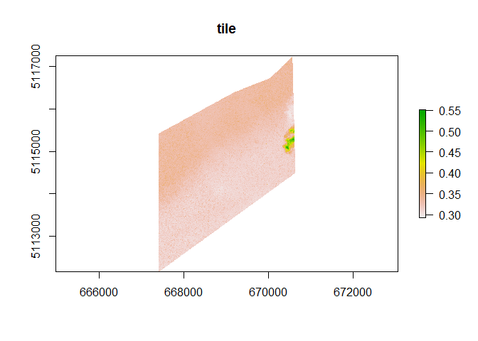
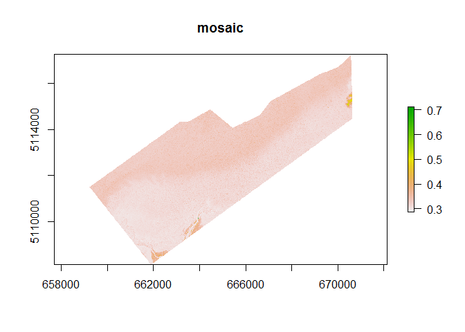
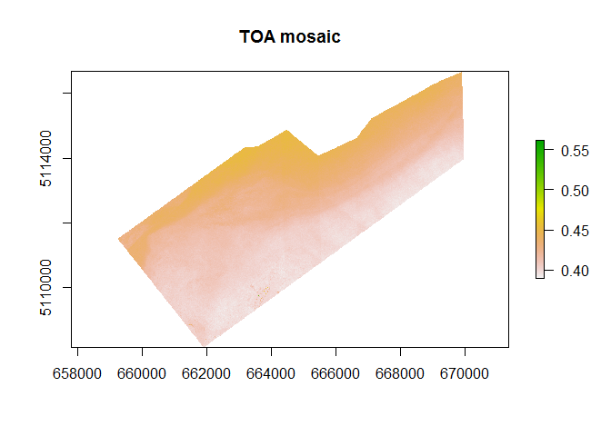
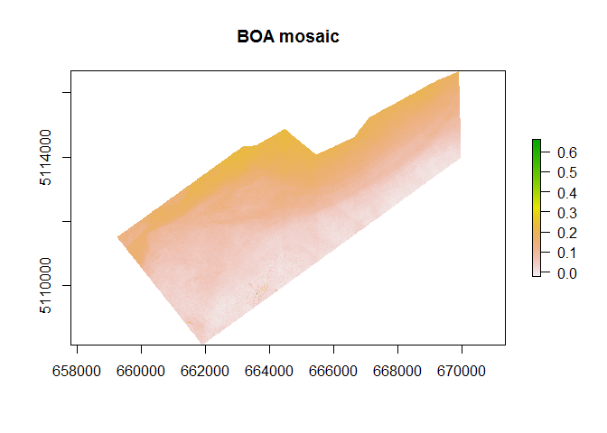

This third script is used to go from top of atmosphere reflectance values to bottom of atmosphere reflectance based on an image based, empirical atmospheric correction model. The necessary inputs depend on the previous scripts, 01_metadata_extraction and 02_radiometric_correction.

The methods used for calibration are detailed in :

A first step before calibration will be to mosaic together all comparable images (some difference remain between them even after calibration), in order for smaller areas to be better corrected based on other images data.

# R setup

All libraries must be installed prior to loading them. Installing them individually is the best course of action, using the install.packages("nameofthepackage") function.

**important : ** Do not forget to change the tmpdir path in the setup code chunk to a disk with a lot of free space. The raster options prevent the data from being all loaded into the RAM and crashing the process due to lack of memory, thus requiring to write large amounts of intermediate products.


```r
rm(list=ls())
library(sf)
library(raster)
library(tidyverse)
library(data.table)
library(satellite)
library(GeoLight)
library(sp)
library(stringr)
# library(doParallel) # could be added at some point to speedup the process
# library(foreach) # could be added at some point to speedup the process

# raster options
rasterOptions(todisk=T) # forces on disk writing instead of in memory
rasterOptions(tmpdir="D:/Arthur/temp") # requires a lot of space for temporary file
```


# mosaic building


```r
#### parameters to change ####
path_to_toa = "//Glaciolab/homes/degranda/MFFP/digitalglobe_archives/toa/MUL/" # path to TOA MUL images, from the previous script
mosaic_output = "//Glaciolab/homes/degranda/MFFP/digitalglobe_archives/toa/mosaic/perdateid/" # path where to write mosaic MUL images (less files, but larger)
```


```r
#### mosaicing ####
TOA = as.data.frame(dir(path_to_toa,full.names=T, pattern=".tif$"))
colnames(TOA)=c("value")

## obtain product details from the filenames
TOA2 = TOA %>%
  mutate(date = str_match(TOA$value, ".*MUL/(.*)_MUL_")[,2]) %>% # this extracts the date from the name string 
  mutate(part = str_match(TOA$value, ".*_01_(.*).tif")[,2]) %>%
  mutate(id = str_match(TOA$value, "_....-(.*)_P00")[,2]) %>% 
  mutate(id_part = paste0(id,"_",part))


for(i in 1:length(unique(TOA2[,5]))){
print(paste0("tile ",i," out of ",length(unique(TOA2[,5]))," at ",Sys.time())) # to see progress

img_d = subset(TOA2, TOA2[,5]==unique(TOA2[,5])[i]) # subsets all rows for a single date


if(length(img_d[,1])>1){ # if this date has many images, they will be mosaiced together
rl = list() # creates an empty list where the rasters will be stored 

for(j in 1:length(img_d[,1])){ # fills the list will all rasters
rl[[j]] = brick(as.character(img_d[,1][j]))
}

rasters.mosaicargs = rl # object to call with the do.call function that will apply mosaic to all rasters
rasters.mosaicargs$fun = mean

mos = do.call(mosaic, rasters.mosaicargs) # mos is the mosaic of all rasters of a single date

writeRaster(mos, paste0(mosaic_output,img_d$date[1],"_",unique(TOA2[,5])[i],"_TOA_MOSAIC.tif"), overwrite=T)
}

if(length(img_d[,1])==1){ # if there was a single image, it will still be written as a mosaic, since it is a complete view of the scene
mos = brick(as.character(img_d[,1][1]))

writeRaster(mos, paste0(mosaic_output,img_d$date[1],"_",unique(TOA2[,5])[i],"_TOA_MOSAIC.tif"), overwrite=T)
TOA2
}
}
```

Mosaic visualisation test

```r
r1v = brick(dir(path_to_toa, full.names=T, pattern=".tif$")[3])
r2v = brick(dir(mosaic_output, full.names=T, pattern=".tif$")[2])
plot(r1v[[1]], main="tile");plot(r2v[[1]], main="mosaic")
```

<!-- --><!-- -->

# DOS-COST correction


```r
#### required inputs ####
atcor_output = "//Glaciolab/homes/degranda/MFFP/digitalglobe_archives/doscost/"
correction_quantile = 0.01 # this is used to apply the 1% DOS correction. taking the 1% quantile instead of minimum value, since real dark objects do not exist.
```


```r
#### correction ####
TOAM = as.data.frame(dir(mosaic_output, full.names=T, pattern=".tif$"))
colnames(TOAM)="value"

TOAM2 = TOAM %>%  # get info from filename for correction
  mutate(id_part = paste0(str_match(TOAM$value,".*-.._(.*)_TOA")[,2]))

rct = read.csv("../data/radiometric_correction_table.csv")
rct$date=lubridate::ymd_hms(rct$date)

angles = rct %>% # this gets the mean angles from every scenes to get best values for every mosaic
  group_by(id_part) %>% 
  summarize(solar_zenith = mean(solar_zenith), view_angle = mean(view_angle)) %>% 
  ungroup

doscost_table = merge(TOAM2,angles)

for( i in 1:dim(doscost_table)[1]){
print(paste0(i," out of ",dim(doscost_table)[1]))
r = brick(as.character(doscost_table[i,2]))
r2 = r
for( b in 1:nlayers(r)){
  r2[[b]] = (pi/cos(doscost_table[i,]$view_angle*pi/180)) *((r[[b]]-quantile(r[[b]], c(correction_quantile)))/cos(doscost_table[i,]$solar_zenith*pi/180))
}
writeRaster(r2, paste0(atcor_output,gsub("T","B",str_sub(doscost_table[i,2],-46))), overwrite=TRUE)
}
```

```
## [1] "1 out of 16"
## [1] "2 out of 16"
## [1] "3 out of 16"
## [1] "4 out of 16"
## [1] "5 out of 16"
## [1] "6 out of 16"
## [1] "7 out of 16"
## [1] "8 out of 16"
## [1] "9 out of 16"
## [1] "10 out of 16"
## [1] "11 out of 16"
## [1] "12 out of 16"
## [1] "13 out of 16"
## [1] "14 out of 16"
## [1] "15 out of 16"
## [1] "16 out of 16"
```

Visualisation of atmospheric correction 


```r
plot(r[[1]],main="TOA mosaic"); plot(r2[[1]], main="BOA mosaic")
```

<!-- --><!-- -->

